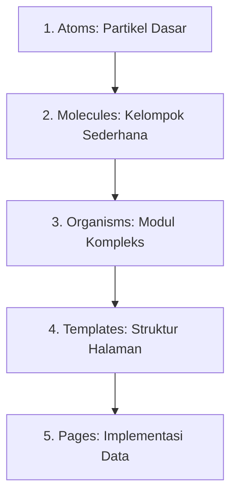
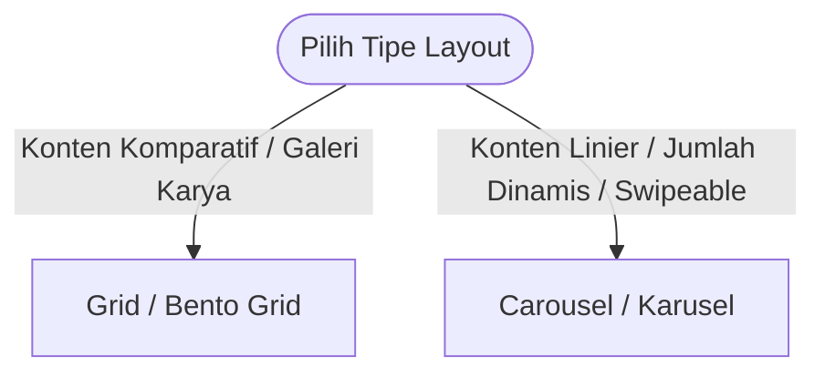

# Panduan Sistem Desain UI/UX & Spesifikasi Global

Dokumen ini merupakan panduan standar desain UI/UX global yang dapat digunakan kembali (*reusable*) di berbagai proyek web dan seluler. Panduan ini dirancang untuk menciptakan antarmuka yang estetis, terstruktur, berperforma tinggi, dan ramah aksesibilitas. Panduan ini bersifat **universal dan reusable** — dapat diterapkan pada berbagai jenis aplikasi web maupun mobile.

---

## 1. Sistem Tipografi (Typography & Fonts)

Gunakan kombinasi font terencana untuk memberikan hierarki informasi yang jelas. Kombinasi yang disarankan di bawah ini memadukan estetika teknikal geometris dengan editorial klasik:

*   **Font Judul (Headline Font - contoh: `Space Grotesk`)**: 
    *   *Karakter*: Geometris, bersih, dan modern.
    *   *Penerapan*: Digunakan untuk judul halaman, sub-judul bagian (H1, H2, H3), angka metrik utama, dan judul kartu.
*   **Font Narasi (Body Font - contoh: `Newsreader` atau Serif sejenis)**: 
    *   *Karakter*: Serif organik dengan tingkat keterbacaan tinggi untuk kalimat panjang.
    *   *Penerapan*: Paragraf panjang, biografi, penjelasan kasus, artikel, dan teks detail.
*   **Font Antarmuka (Label Font - contoh: `Manrope` atau Sans-Serif sejenis)**: 
    *   *Karakter*: Netral, modern, dan sangat terbaca pada ukuran mikro.
    *   *Penerapan*: Tombol, menu navigasi, placeholder input, teks petunjuk (*helper text*), dan metadata kecil.
*   **Font Telemetry/Kode (Monospace Font - contoh: `Geist Mono` atau sejenis)**:
    *   *Karakter*: Teknikal, seragam.
    *   *Penerapan*: Nilai angka, data teknis, blok kode, log sistem, dan teks telemetry HUD.

### Aturan Skala & Spasi Teks
*   **Ukuran Minimum Mobile**: Teks konten utama tidak boleh kurang dari `16px` (mencegah auto-zoom paksa oleh browser iOS).
*   **Tinggi Baris (Line-Height)**: Gunakan `1.5` hingga `1.75` untuk teks paragraf panjang agar tidak terasa sesak.
*   **Lebar Kontainer Teks**: Batasi lebar baris teks narasi sekitar **35–60 karakter** pada seluler dan **60–75 karakter** pada desktop agar mata tidak lelah bergeser.

---

## 2. Jarak, Margin, & Skala Spasi (Padding & Margin Scale)

Gunakan sistem spasi inkremental berbasis kelipatan **4dp / 8dp** untuk menjaga ritme visual yang konsisten di semua halaman:

| Token Spasi | Nilai Pixel | Contoh Penggunaan |
| :--- | :--- | :--- |
| **`space-1`** | `4px` | Margin internal mikro, jarak antara ikon dengan teks label. |
| **`space-2`** | `8px` | Gap antar tombol navigasi kecil, padding internal komponen kecil. |
| **`space-4`** | `16px` | Padding kartu (card), jarak antar elemen form input. |
| **`space-6`** | `24px` | Gutter sisi mobile, jarak antar baris konten sedang. |
| **`space-8`** | `32px` | Jarak antar komponen besar, padding vertikal section mobile. |
| **`space-12`**| `48px` | Margin antar section di desktop, padding vertikal banner. |
| **`space-16`**| `64px` | Jarak antar modul utama halaman desktop. |

### Margin Batas Layar (Screen Gutters)
*   **Mobile (< 640px)**: Gutter horizontal `16px` atau `24px` (`px-4` atau `px-6`).
*   **Tablet (640px - 1024px)**: Gutter horizontal `32px` (`px-8`).
*   **Desktop (> 1024px)**: Gutter horizontal `48px` hingga `80px` (`px-12` hingga `px-20`).

---

## 3. Metodologi Komponen: Atomic Design

Metodologi **Atomic Design** memecah komponen antarmuka menjadi 5 tingkatan hierarki untuk menciptakan pustaka komponen yang modular, mudah dipelihara, dan dapat digunakan kembali secara fleksibel:



### 1. Atoms (Atom)
*   **Definisi**: Blok pembangun dasar antarmuka yang tidak dapat dipecah lagi secara fungsional tanpa kehilangan kegunaannya.
*   **Karakteristik**: Bersifat *stateless* (tidak menyimpan state data API) dan hanya menerima visual props.
*   **Contoh**:
    *   `Button`: Tombol interaktif dengan varian primer/sekunder.
    *   `Input`: Bidang teks input kosong.
    *   `Icon`: Lambang SVG (misal: Lucide icons).
    *   `Badge/Tag`: Label teks dengan warna latar untuk status/kategori.

### 2. Molecules (Molekul)
*   **Definisi**: Kombinasi beberapa atom yang bersatu untuk menjalankan satu tanggung jawab fungsional sederhana.
*   **Karakteristik**: Mulai menangani interaksi pengguna tingkat dasar (misal: penanganan event focus, trigger onChange).
*   **Contoh**:
    *   `FormField`: Kombinasi dari atom `Label` + `Input` + pesan error `Label`.
    *   `SearchBox`: Gabungan atom `Input` pencarian + `Button` cari + `Icon` kaca pembesar.
    *   `TabButton`: Gabungan atom `Button` + `Icon` + status penanda aktif.

### 3. Organisms (Organisme)
*   **Definisi**: Modul antarmuka kompleks yang terdiri dari gabungan molekul dan/atau atom. Memiliki tanggung jawab operasional yang independen.
*   **Karakteristik**: Membentuk bagian antarmuka yang utuh dan dapat dipindahkan antar layout dengan mudah.
*   **Contoh**:
    *   `Topbar/Navbar`: Menggabungkan molekul menu navigasi, tombol toggle tema, dan logo.
    *   `CardItem`: Kartu data (misal: proyek/sertifikat) yang memuat molekul thumbnail gambar, deskripsi, dan tombol aksi detail.
    *   `LoginForm`: Formulir login utuh yang menggabungkan beberapa `FormField` molekul dan tombol submit atom.

### 4. Templates (Templat)
*   **Definisi**: Struktur tata letak tingkat halaman (*skeleton*) yang fokus pada distribusi letak komponen (Grid/Flex) tanpa memedulikan data asli.
*   **Karakteristik**: Menentukan bagaimana organisme berinteraksi dalam satu tata ruang layout. Menggunakan placeholder atau data mock.
*   **Contoh**:
    *   `DashboardLayout`: Template yang menentukan posisi `Sidebar` di kiri, `Topbar` di atas, dan area konten utama di kanan.
    *   `TwoColumnLayout`: Templat pembagi konten dengan rasio 70:30 untuk detail artikel/studi kasus.

### 5. Pages (Halaman)
*   **Definisi**: Instansiasi konkret dari templat antarmuka yang diisi dengan konten dinamis asli dari API, database, atau state global.
*   **Karakteristik**: Menangani pengambilan data (*data fetching*), penanganan error tingkat sistem, interaksi rute, dan state global (Redux/Context).
*   **Contoh**:
    *   `HomePage`: Halaman depan portofolio yang mengambil data profil aktif dan menyuapinya ke organisme karusel dan grid.
    *   `DashboardSettingsPage`: Halaman kelola pengaturan akun admin.

---

## 4. Sistem Tata Letak (Layout & Responsiveness)

Menerapkan pendekatan desain **Mobile-First** secara ketat untuk menjamin fungsionalitas di layar terkecil sebelum menskalakannya ke layar besar:

*   **Pencegahan Scroll Horizontal**: Seluruh layout kontainer harus menggunakan unit lebar relatif (`w-full`, `max-w-x`) dan properti `box-sizing: border-box`. Kontainer dilarang keras menggunakan lebar statis (`px`) yang melebihi lebar layar mobile minimum (320px).
*   **Batas Lebar Kontainer (Desktop Max-Width)**: Batasi kontainer utama halaman pada rentang `max-w-6xl` (1152px) hingga `max-w-7xl` (1280px) agar tata letak tetap proporsional pada monitor layar lebar.
*   **Safe-Area Compliance**: Selalu berikan inset padding tambahan pada bagian bawah halaman seluler untuk mencegah elemen interaktif/tombol melayang tertutup oleh *home indicator bar* bawaan OS (misalnya iOS gesture bar).

---

## 5. Perbandingan Layout: Grid vs Karusel (Carousel)

Pemilihan tipe layout harus disesuaikan dengan jenis konten dan pola interaksi pengguna:



### A. Grid & Bento Grid (Kapan Harus Digunakan?)
*   **Karakteristik**: Tata letak dua dimensi yang menyeimbangkan konten secara struktural.
*   **Kapan Cocok**:
    *   Galeri proyek, portofolio karya, dasbor analitik.
    *   Bento Grid sangat cocok jika ingin menonjolkan bobot visual asimetris (misalnya: Proyek unggulan berukuran besar, proyek biasa berukuran lebih kecil).
*   **Penerapan Terbaik**:
    *   Gunakan grid 12-kolom yang dinamis dengan properti `col-span` bervariasi berdasarkan breakpoints (contoh: `col-span-12` di mobile, `md:col-span-6` di tablet, `lg:col-span-8` untuk featured card di desktop).

### B. Karusel / Carousel (Kapan Harus Digunakan?)
*   **Karakteristik**: Tata letak satu dimensi horizontal yang menghemat ruang vertikal.
*   **Kapan Cocok**:
    *   Kumpulan sertifikat, logo mitra, testimoni klien, galeri gambar sub-kasus.
    *   Data dinamis yang jumlahnya tidak terduga dan tidak harus langsung dilihat sekaligus.
*   **Penerapan Terbaik**:
    *   Aktifkan *momentum scrolling* horizontal (`overflow-x-auto snap-x snap-mandatory`) yang bersahabat dengan sentuhan jari.
    *   Sediakan dot indikator di bagian bawah yang diperbarui secara dinamis berdasarkan posisi gulir (`scrollLeft`), serta tombol panah navigasi kiri/kanan sebagai cadangan aksesibilitas.

---

## 6. Input & Form (Interaksi, Validasi, & File Upload)

Komponen formulir harus memandu pengguna dengan memberikan umpan balik visual instan.

### A. Status UI Input (Input UI States)

```
[ Default State ] ── Hover/Focus ── Valid/Error ── Disabled/Read-Only
```

1.  **Default**: Border tipis netral dengan kontras rendah terhadap warna permukaan kartu.
2.  **Hover**: Border sedikit lebih tebal/gelap dan perubahan ikon kursor menjadi pointer.
3.  **Focus**: Border berubah warna menjadi aksen utama (misal: warna primer neon), disertai dengan bayangan halus (*glow*) tanpa menggeser posisi elemen.
4.  **Disabled**: Opacity dikurangi (`38% - 50%`), kursor berubah menjadi `not-allowed`, dan form dikunci dari masukan data.
5.  **Read-Only**: Tampilan bersih tanpa bayangan focus, namun teks tetap dapat disalin (berbeda secara visual dengan disabled).

### B. Validasi & Penanganan Error Form (Error Handling)
*   **Lokasi Pesan Error**: Tulis pesan error yang jelas dan spesifik tepat di bawah kolom input yang bermasalah. Hindari menumpuk semua pesan error hanya di bagian atas form.
*   **Indikasi Warna & Ikon**: Kolom yang bermasalah harus berubah warna menjadi merah semantik (warna error) pada border dan teks pesan errornya, disertai ikon peringatan (tidak boleh mengandalkan warna merah saja demi pengguna buta warna).
*   **Manajemen Fokus**: Setelah pengguna mengirimkan form dan terjadi error, pindahkan fokus kursor secara otomatis ke kolom pertama yang tidak valid.

### C. Drag & Drop & Cropping Image (File Upload)
*   **Drop Zone State**: Saat berkas ditarik di atas area upload, ubah gaya border area menjadi garis putus-putus (*dashed border*) yang menyala/aktif, serta tampilkan overlay teks penjelas (misalnya: "Lepaskan berkas di sini").
*   **Cropping Interface**:
    *   Tampilkan modal overlay yang membatasi gerakan foto di dalam rasio aspek (*aspect ratio*) yang ditargetkan (misalnya persegi `1:1` untuk avatar).
    *   Sediakan slider zoom interaktif di bawah area potong dengan tap target yang cukup besar untuk memudahkan pengguna mobile.

---

## 7. Sistem Tombol & Loading State (Button & Loading States)

Tombol adalah elemen interaktif utama untuk mengirimkan data atau memicu alur kerja antarmuka.

### A. Varian Tombol (Button Variants)
1.  **Primary Button (Tombol Utama)**: Menggunakan warna latar belakang primer (`--color-primary`) dengan teks kontras tinggi (`--color-on-primary`). Digunakan hanya untuk tindakan konfirmasi final utama (Simpan, Kirim, Tambah Baru).
2.  **Secondary Button (Tombol Sekunder)**: Menggunakan batas border tipis (`border border-outline/20`) dengan background transparan. Digunakan untuk tindakan sekunder (Batal, Kembali, Edit).
3.  **Ghost Button**: Tanpa batas border dan tanpa warna latar belakang bawaan (hanya muncul warna permukaan tipis saat di-hover). Digunakan untuk aksi yang minim prioritas (Tutup, Bersihkan filter).
4.  **Destructive Button**: Menggunakan warna merah semantik (`--color-error`). Digunakan khusus untuk konfirmasi penghapusan permanen.

### B. Status Loading & Pencegahan Double-Submit
*   **Double-Submit Prevention**: Saat proses pengiriman data API asinkron sedang berlangsung, tombol pengirim wajib dinonaktifkan secara programatik (`disabled = true`) untuk mencegah pengiriman data ganda akibat pengguna mengeklik berulang kali secara tidak sengaja.
*   **Loading Indicator**: Ganti teks tombol secara dinamis dengan ikon spinner berputar atau teks seperti *"Memproses..."*. Ukuran (lebar dan tinggi) tombol wajib dipertahankan tetap sama agar tidak menyebabkan pergeseran tata letak antarmuka di sekitarnya.

---

## 8. Sistem Notifikasi & Toast (Notification & Toast System)

Sistem notifikasi toast digunakan untuk memberikan umpan balik asinkron di luar validasi formulir langsung, terutama untuk kegagalan operasi sistem, jaringan, atau status global.

### A. Klasifikasi Tipe & Gaya Visual Toast
Desain toast harus memiliki warna latar belakang kontras tinggi dengan aksen warna semantik di sisi tepi atau ikon:

| Tipe Toast | Warna Aksen | Gaya Ikon | Kegunaan Utama |
| :--- | :--- | :--- | :--- |
| **`Success`** | Hijau Semantik | Check Circle | Operasi berhasil (misal: "Profil berhasil disimpan", "Urutan proyek disimpan"). |
| **`Error`** | Merah Semantik | Alert Circle | Kegagalan kritis sistem atau jaringan. |
| **`Warning`** | Kuning/Jingga | Alert Triangle | Peringatan tindakan (misal: "Koneksi lambat", "File terlalu besar"). |
| **`Info`** | Biru Semantik | Info | Informasi kontekstual non-kritis (misal: "Sesi Anda akan berakhir"). |

### B. Penanganan Error di Luar Formulir (Non-Form Error Handling)
Formulir menangani error input lokal, sedangkan Toast digunakan untuk menangani skenario global berikut:
1.  **Kegagalan Koneksi/API (500 atau Network Error)**:
    *   *Skenario*: Server mati, koneksi internet pengguna terputus saat fetch data.
    *   *Feedback*: Tampilkan toast merah dengan pesan bersahabat (misal: *"Koneksi terganggu. Silakan coba beberapa saat lagi."*) disertai tombol **"Retry" (Coba Lagi)** langsung di dalam toast.
2.  **Sesi Kedaluwarsa (Session Timeout)**:
    *   *Skenario*: Token JWT di cookie kedaluwarsa atau dihapus di middleware saat pengguna melakukan aksi di dashboard.
    *   *Feedback*: Tampilkan toast kuning berisi pesan *"Sesi Anda telah berakhir. Anda akan diarahkan ke halaman login."*, pertahankan selama 4 detik sebelum mengarahkan rute secara otomatis.
3.  **Kegagalan Upload File Besar/Tidak Valid**:
    *   *Skenario*: Pengguna mencoba mengunggah CV PDF atau gambar melebihi batas (misal: > 5MB) atau format tidak diizinkan.
    *   *Feedback*: Tampilkan toast error dengan alasan spesifik (misal: *"Gagal mengunggah berkas. Ukuran maksimum adalah 5MB."*).
4.  **Kegagalan Operasi Destruktif / Bulk Delete**:
    *   *Skenario*: Gagal menghapus item karena foreign key constraint di database.
    *   *Feedback*: Tampilkan toast error yang menjelaskan item tidak dapat dihapus karena masih digunakan. Jika berhasil, berikan opsi tombol **"Undo" (Batalkan)** pada toast sukses.

### C. Aturan Perilaku (Toast Behavior) & Aksesibilitas
*   **Auto-Dismiss**: Toast tipe `Success` dan `Info` wajib ditutup otomatis dalam waktu **3 sampai 5 detik** agar tidak menumpuk di layar.
*   **Persistence**: Toast tipe `Error` atau `Warning` kritis **dilarang ditutup otomatis**. Toast harus tetap berada di layar sampai pengguna menekan tombol tutup `[X]` secara manual untuk memastikan pesan terbaca.
*   **Batas Antrian (Stacking Limit)**: Batasi maksimal **3 toast** bertumpuk di layar secara bersamaan (biasanya di kanan atas atau bawah tengah). Toast lama akan tergeser keluar (slide-out) secara otomatis jika ada toast baru.
*   **Aksesibilitas Pembaca Layar (A11y)**:
    *   Toast biasa menggunakan atribut `aria-live="polite"` agar tidak memotong pembacaan layar yang sedang aktif.
    *   Toast `Error` kritis wajib menggunakan `role="alert"` atau `aria-live="assertive"` agar langsung diumumkan seketika oleh *screen reader*.

---

## 9. Sistem Modal & Dialog Konfirmasi (Modal & Confirmation Dialogs)

Dialog modal memotong fokus pengguna untuk meminta konfirmasi atau memproses informasi tambahan tanpa berpindah halaman.

### A. Backdrop (Scrim) & Visual Styling
*   **Scrim Overlay**: Gunakan overlay hitam dengan tingkat transparansi `40%` sampai `60%` dan efek kabur (`backdrop-blur-md` atau kustom `backdrop-filter: blur(4px)`) untuk mengisolasi konten latar belakang dan memusatkan pandangan pengguna pada modal.
*   **Responsive Sizing**: 
    *   Mobile: Modal melebar memenuhi layar (`w-full` dengan sedikit margin horizontal, `mx-4`) atau bergeser dari bawah ke atas (*bottom sheet* style).
    *   Desktop: Ukuran lebar dibatasi pada rentang `max-w-md` (448px) hingga `max-w-lg` (512px).

### B. Struktur Layout Modal: Fixed Header & Footer, Scrollable Body

Modal wajib menerapkan struktur tiga-bagian (*three-part layout*) agar konten yang panjang tetap dapat dinavigasi tanpa mengubah ukuran modal:

*   **Header Modal (Fixed/Sticky)**:
    *   Posisi header dikunci di bagian atas modal menggunakan `position: sticky; top: 0` atau dengan memisahkannya dari area scroll.
    *   Header berisi judul modal dan tombol tutup `[X]`. Header **tidak ikut ter-scroll** bersama konten body.
    *   Terapkan efek bayangan bawah halus (`box-shadow: 0 1px 0 rgba(0,0,0,0.1)`) sebagai pemisah visual dari area body saat body di-scroll.

*   **Body Modal (Scrollable)**:
    *   Hanya area body yang diizinkan untuk di-scroll secara vertikal (`overflow-y: auto`).
    *   Tinggi body dibatasi dengan `max-height` yang dihitung relatif terhadap tinggi viewport (misalnya `max-h-[60vh]` atau `max-h-[calc(100vh-200px)]`) agar header dan footer selalu terlihat.
    *   **Wajib menerapkan custom scrollbar** pada area body modal (lihat Bagian 9D).

*   **Footer Modal (Fixed/Sticky)**:
    *   Posisi footer dikunci di bagian bawah modal menggunakan `position: sticky; bottom: 0` atau dipisahkan dari area scroll.
    *   Footer berisi tombol aksi utama (Simpan, Konfirmasi) dan tombol sekunder (Batal). Footer **tidak ikut ter-scroll** dan selalu terlihat tanpa pengguna harus menggulir ke bawah.
    *   Terapkan efek bayangan atas halus (`box-shadow: 0 -1px 0 rgba(0,0,0,0.1)`) sebagai pemisah visual dari area body.

```
┌─────────────────────────────────┐
│  [Header - FIXED]  Judul   [X]  │ ← Tidak bergerak
├─────────────────────────────────┤
│                                 │
│  [Body - SCROLLABLE]            │ ← Hanya bagian ini yang scroll
│  Konten panjang...              │   dengan custom scrollbar
│  ...                            │
│                                 │
├─────────────────────────────────┤
│  [Footer - FIXED]  Batal  Simpan│ ← Tidak bergerak
└─────────────────────────────────┘
```

### C. Interaksi & Konfirmasi Aksi Destruktif
*   **Metode Penutupan Modal (Non-Destruktif)**: Pengguna dapat menutup modal dengan menekan tombol tutup `[X]`, menekan tombol `Batal` (Cancel), atau mengeklik area backdrop gelap.
*   **Modal Destruktif (Double Confirmation)**:
    *   Untuk tindakan berisiko tinggi (misalnya menghapus profil, menghapus data proyek permanen), tombol konfirmasi aksi wajib menggunakan warna merah semantik (warna error).
    *   Modal destruktif **tidak boleh ditutup** hanya dengan mengeklik area backdrop luar guna mencegah penutupan yang tidak disengaja. Pengguna harus memilih `Batal` atau `Konfirmasi` secara sadar.

### D. Custom Scrollbar Minimalis

Setiap area yang dapat di-scroll (termasuk body modal, sidebar, dan kontainer list panjang) **wajib mengganti tampilan scrollbar bawaan browser** dengan versi yang lebih minimalis dan sesuai tema antarmuka. Scrollbar default browser bervariasi antar platform dan terlihat tidak konsisten secara visual.

**Implementasi CSS (Cross-browser):**

```css
/* === Custom Scrollbar — Minimalis === */

/* Untuk browser berbasis WebKit (Chrome, Safari, Edge) */
.scrollable::-webkit-scrollbar {
  width: 4px;       /* Lebar scrollbar vertikal */
  height: 4px;      /* Tinggi scrollbar horizontal */
}

.scrollable::-webkit-scrollbar-track {
  background: transparent; /* Track transparan agar tidak menambah visual noise */
}

.scrollable::-webkit-scrollbar-thumb {
  background-color: rgba(0, 0, 0, 0.18); /* Warna thumb: hitam transparan untuk light mode */
  border-radius: 999px;  /* Ujung pill/capsule */
  border: none;
}

.scrollable::-webkit-scrollbar-thumb:hover {
  background-color: rgba(0, 0, 0, 0.32); /* Lebih gelap saat hover */
}

/* Untuk Firefox (menggunakan scrollbar-width dan scrollbar-color) */
.scrollable {
  scrollbar-width: thin;
  scrollbar-color: rgba(0, 0, 0, 0.18) transparent;
}
```

**Variasi untuk Dark Mode (opsional, jika app mendukung dark mode):**

```css
/* Override untuk dark mode (jika mendukung dark mode) */
.dark .scrollable::-webkit-scrollbar-thumb {
  background-color: rgba(255, 255, 255, 0.15);
}
.dark .scrollable::-webkit-scrollbar-thumb:hover {
  background-color: rgba(255, 255, 255, 0.30);
}
.dark .scrollable {
  scrollbar-color: rgba(255, 255, 255, 0.15) transparent;
}
```

**Aturan Penerapan Custom Scrollbar:**
*   **Wajib diterapkan** pada: body modal, sidebar navigasi, dropdown list panjang, area preview konten, dan kontainer list data (tabel, inbox).
*   **Lebar scrollbar** tidak boleh melebihi `6px` agar tidak memakan ruang konten yang berharga.
*   **Scrollbar thumb** harus cukup kontras untuk terlihat, namun tidak mendominasi antarmuka — gunakan opacity rendah (`10% - 20%`) sebagai baseline dan tingkatkan saat hover (`25% - 35%`).
*   **Hindari** menghilangkan scrollbar sepenuhnya (`display: none`) pada elemen yang dapat di-scroll, karena ini menghilangkan petunjuk visual bagi pengguna bahwa konten masih berlanjut ke bawah.

### E. Aksesibilitas Keyboard (Keyboard Navigation & Focus Trap)
*   **Focus Trap**: Begitu modal terbuka, fokus keyboard (tekanan tombol `Tab`) harus dikunci hanya pada elemen interaktif di dalam modal tersebut. Fokus dilarang lolos ke elemen latar belakang.
*   **Tombol `Esc`**: Menekan tombol `Escape` pada keyboard harus memicu penutupan modal instan (kecuali untuk modal destruktif terkunci).

---

## 10. Desain Keadaan Kosong (Empty States)

Tampilan kosong (*empty state*) tidak boleh berupa halaman putih kosong, melainkan area terencana yang informatif untuk memandu tindakan pengguna selanjutnya.

### A. Elemen Visual Penyusun Empty State
Sebuah area kosong yang baik wajib memuat struktur berikut:
1.  **Ikon/Ilustrasi Redup**: Gunakan ikon deskriptif berukuran besar (misal: `48px` - `64px`) dengan opacity rendah (`opacity-30` atau `opacity-40`) untuk memberikan isyarat visual tanpa mendominasi antarmuka.
2.  **Judul Ringkas**: Kalimat singkat menjelaskan apa yang kosong (misal: *"Belum Ada Proyek Ditambahkan"*).
3.  **Deskripsi Pendukung**: Kalimat penjelasan pendek untuk memicu aksi pengguna (misal: *"Silakan unggah proyek terbaik Anda untuk ditampilkan pada portofolio publik."*).
4.  **Tombol CTA Utama**: Menyediakan tombol aksi utama di bawah deskripsi untuk langsung mengisi kekosongan tersebut (misal: *"Tambah Proyek Baru"*).

### B. Penempatan & Dimensi
*   Empty state harus diposisikan di tengah-tengah kontainer utama halaman, baik secara vertikal maupun horizontal (`flex flex-col items-center justify-center text-center`).
*   Lebar blok teks dibatasi maksimal `400px` untuk menjaga keterbacaan layout.

---

## 11. Sistem Navigasi & Breadcrumbs (Navigation & Breadcrumbs)

Navigasi memberikan orientasi lokasi dan jalan kembali bagi pengguna saat berada di dashboard maupun halaman studi kasus.

### A. Header Navigasi Lengket (Sticky Header)
*   **Dimensi**: Ketinggian header navigasi dibatasi pada rentang `64px` (16unit) hingga `80px` (20unit).
*   **Visual**: Terapkan efek glassmorphism (`backdrop-blur-md` dengan background transparan beropasitas `70% - 80%`) untuk memberikan estetika modern, disertai garis pembatas bawah tipis (`1px`) yang samar (`border-outline/10`).
*   **Mobile Hamburgers**: Tombol menu hamburger di seluler wajib memiliki ukuran area sentuh minimal `44x44px`.

### B. Breadcrumbs (Jejak Tautan)
*   **Struktur Hirarki**: Gunakan notasi horizontal berurutan (misal: `Dashboard > Proyek > Edit Proyek`).
*   **Status Tautan**:
    *   Halaman saat ini (posisi terakhir) ditulis tebal (*bold*), menggunakan warna foreground utama, dan **tidak dapat diklik**.
    *   Halaman induk (parent pages) ditulis dengan warna kontras sedang dan wajib berupa tautan yang dapat diklik untuk memudahkan navigasi mundur cepat.
*   **Pemisah (Separator)**: Gunakan simbol visual sederhana seperti garis miring `/` atau kurung siku `>` dengan warna pudar agar tidak mengalihkan perhatian dari nama halaman.

---

## 12. Papan Informasi: Segmented Control, Tabs, & Tooltips

Mengatur tampilan konten tersegmentasi dan memberikan bantuan informasi mikro di antarmuka.

### A. Sistem Tab & Segmented Control
*   **Tujuan**: Mengurangi penumpukan informasi vertikal dengan membagi menu ke dalam sub-kategori sejajar.
*   **Penanda Aktif (Active Indicator)**:
    *   Gunakan garis bawah (*bottom line border*) setebal `2px` berwarna primer neon, atau terapkan latar belakang kontainer dengan bayangan tipis yang bergeser halus (`duration-200`) menggunakan CSS transition saat berpindah tab.
    *   Teks tab aktif wajib menggunakan bobot font lebih tebal (`font-bold` atau `font-semibold`) untuk membedakannya dengan opsi yang tidak terpilih.

### B. Sistem Tooltip & Popover
*   **Tooltip**: Penjelasan teks mini (maksimal 2 baris) yang muncul ketika kursor mengambang di atas ikon pemicu (contoh: ikon bantuan `?` di samping label form).
*   **Popover**: Kontainer informasi lebih dinamis (dapat memuat link, teks berformat, atau tombol aksi kecil) yang muncul ketika elemen pemicu diklik.
*   **Aturan Trigger Delay**:
    *   Kemunculan Tooltip wajib diberi penundaan waktu (*trigger delay*) sekitar **200ms - 300ms** setelah hover. Ini penting untuk mencegah ketidaknyamanan visual (tooltip berkedip-kedip) ketika pengguna hanya menggeser kursor melintasi layar secara cepat.
    *   **Auto-Positioning**: Tooltip/Popover wajib menyesuaikan lokasinya secara otomatis (ke atas, kanan, bawah, kiri) agar tidak terpotong di sudut layar browser.

---

## 13. Pengurutan Item (Sortable Items)

Saat mengimplementasikan fitur Drag & Drop sorting (misalnya menggunakan `@dnd-kit`), visualisasikan proses pergeseran agar pengguna merasa memiliki kendali penuh:

*   **Elevasi & Shadow**: Item yang sedang ditarik (*active item*) harus tampak terangkat dengan menambahkan efek bayangan dalam (`box-shadow`), opasitas sedikit dikurangi (`opacity-80`), dan ditingkatkan ke tingkat layer teratas (`z-index-50`).
*   **Kursor Feedback**: Ubah ikon kursor mouse menjadi `grab` saat diarahkan ke pegangan seret (*drag handle*), dan menjadi `grabbing` saat proses penyeretan berlangsung.
*   **Placeholder Gap**: Sediakan area kosong transparan (*placeholder outline*) di lokasi penempatan baru agar pengguna dapat melihat ke mana item tersebut akan jatuh jika dilepaskan.

---

## 14. Sistem Skeleton UI (Skeleton UI Loading States)

Skeleton UI digunakan untuk menggantikan spinner pemuatan tradisional. Ini memberikan persepsi performa halaman yang lebih cepat dengan menampilkan tata letak sementara yang menyerupai bentuk konten asli sebelum data dari API berhasil dimuat.

```
[ Data Sedang Dimuat ] ──> Tampilkan Skeleton UI (Pulsing/Shimmer) ──> Swap dengan Elemen Asli (Fade-in)
```

### A. Pemisahan Kode: Skeleton Wajib Dipisah dari Komponen Konten

> ⚠️ **Aturan Arsitektur Kritis**: Kode komponen Skeleton UI **wajib ditempatkan dalam file/komponen terpisah** dari komponen konten halaman aslinya. Skeleton **tidak boleh** ditulis secara inline bercampur dengan JSX konten asli menggunakan kondisi `if/else` atau ternary operator sederhana di dalam satu file komponen yang sama.

**Alasan (Why):**
*   **Keterbacaan Kode**: Mencampur JSX skeleton dengan JSX konten asli dalam satu file menciptakan komponen yang panjang, sulit dibaca, dan sulit di-maintain.
*   **Reusabilitas**: Komponen skeleton yang terpisah dapat digunakan kembali di beberapa halaman yang menampilkan jenis konten serupa (misal: `SkeletonCardItem` dapat digunakan di halaman Proyek dan halaman Sertifikat).
*   **Separation of Concerns**: Komponen konten fokus pada logika tampilan data; komponen skeleton fokus pada representasi struktur visual saat loading.

**Pola yang Benar (Do ✅):**

```
/components
  /project
    ProjectCard.tsx          ← Komponen konten asli
    ProjectCard.skeleton.tsx ← Komponen skeleton TERPISAH
  /certificate
    CertificateCard.tsx
    CertificateCard.skeleton.tsx
```

```tsx
// Di halaman atau komponen induk (parent):
import ProjectCard from '@/components/project/ProjectCard';
import ProjectCardSkeleton from '@/components/project/ProjectCard.skeleton';

export default function ProjectsPage() {
  const { data, isLoading } = useFetchProjects();

  if (isLoading) {
    // Render skeleton list dari komponen terpisah
    return (
      <div className="grid gap-4">
        {Array.from({ length: 6 }).map((_, i) => (
          <ProjectCardSkeleton key={i} />
        ))}
      </div>
    );
  }

  return (
    <div className="grid gap-4">
      {data.map((project) => (
        <ProjectCard key={project.id} data={project} />
      ))}
    </div>
  );
}
```

**Pola yang Salah (Don't ❌):**

```tsx
// ❌ JANGAN lakukan ini — skeleton bercampur dengan konten asli
export default function ProjectCard({ data, isLoading }) {
  return (
    <div className="card">
      {isLoading ? (
        <div className="skeleton w-full h-6 rounded animate-pulse" />
      ) : (
        <h2>{data.title}</h2>
      )}
      {isLoading ? (
        <div className="skeleton w-3/4 h-4 rounded animate-pulse" />
      ) : (
        <p>{data.description}</p>
      )}
    </div>
  );
}
```

### B. Gaya Visual & Efek Animasi
*   **Warna Dasar Kontainer**: Gunakan abu-abu netral dengan tingkat saturasi rendah untuk menyesuaikan skema warna latar belakang.
    *   *Light Mode*: Tailwind `bg-neutral-200` atau `#e5e5e5` (default, digunakan di light theme).
    *   *Dark Mode*: Tailwind `bg-neutral-700` atau `#404040` (jika mendukung dark mode).
*   **Efek Shimmer (Sapuan Cahaya)**: Skeleton wajib memiliki animasi sapuan cahaya dari kiri ke kanan yang berputar secara mulus menggunakan gradien linier transparan, atau menggunakan animasi denyut bawaan CSS (`animate-pulse`) dengan transisi opasitas dari `0.5` ke `1` secara berkala.

### C. Kemiripan Bentuk & Geometri (Shape Mimicry)
Setiap elemen visual asli wajib memiliki padanan bentuk skeleton yang serupa untuk menghindari kejutan tata letak:
1.  **Avatar / Foto Profil**: Gunakan lingkaran penuh (`rounded-full`) dengan ukuran lebar dan tinggi yang sama persis dengan avatar asli (misal: `w-12 h-12`).
2.  **Gambar / Thumbnail**: Gunakan persegi panjang bersudut tumpul (`rounded-lg` atau `rounded-xl`) dengan mengunci rasio aspek gambar asli (contoh: `aspect-video` atau `aspect-[16/10]`).
3.  **Teks & Paragraf**:
    *   Dirender sebagai garis horizontal dengan ujung tumpul (`rounded-md` atau `rounded-full`).
    *   Tinggi skeleton teks judul rata-rata `18px` - `24px`, sedangkan teks paragraf `12px` - `14px`.
    *   *Penting*: Jika memuat paragraf multi-baris, baris terakhir wajib dibuat lebih pendek (misalnya selebar `w-3/4` atau `w-1/2`) untuk meniru pemutusan kalimat alami.

### D. Pencegahan CLS (Cumulative Layout Shift) & Transisi Mulus
*   **Konsistensi Dimensi**: Setiap kerangka skeleton wajib membungkus area dengan tinggi (`height`) dan spasi margin/padding yang identik dengan kartu konten asli agar layout tidak melompat ketika data terisi.
*   **Efek Perpindahan Mulus (Conditional Swap)**: Saat status loading selesai (`isLoading === false`), jangan langsung mengganti komponen secara kasar. Terapkan efek transisi memudar lembut (*fade-in* dengan opasitas `0` ke `1` selama `300ms`) pada elemen data asli untuk menyembunyikan pergantian aset.

---

## 15. Optimasi Kinerja UI (Performance & UX)

Aplikasi dengan visual premium harus tetap ringan dan responsif dengan meminimalkan pergeseran tata letak dan beban pemrosesan:

### A. Pencegahan Layout Shift (CLS - Cumulative Layout Shift)
*   **Eksplisitkan Dimensi Media**: Selalu tentukan rasio aspek (`aspect-ratio`) atau tinggi dan lebar piksel pada tag gambar dan video sebelum aset dimuat.
*   **Skeleton Integration**: Terapkan komponen Skeleton UI (seperti yang didefinisikan pada bagian 14) secara default pada setiap modul pemuatan data asinkron.

### B. Pembatasan Transisi & GPU Acceleration
*   **Animasi Efisien**: Gunakan properti CSS `transform` (skala, rotasi, translasi) dan `opacity` untuk animasi interaktif. Hindari menganimasikan properti layout seperti `width`, `height`, `top`, dan `left` karena akan memaksa browser melakukan kalkulasi ulang tata letak (*reflow*) yang memicu lag pada perangkat dengan spesifikasi rendah.
*   **Damping Physics**: Jika menggunakan animasi pegas (*spring physics*), terapkan batas nilai toleransi agar pergerakan tidak memantul tanpa henti (*jittering*).
*   **Debounce & Throttle**: Terapkan metode pembatasan frekuensi pada fungsi yang mendengarkan aktivitas browser berulang (seperti `window.onscroll` atau `window.onresize`) agar tidak membebani pemrosesan utama (*main thread*).

---

## 16. Lembar Evaluasi Kualitas UI/UX (Global QC Checklist)

Gunakan checklist ini sebagai validasi sebelum meluncurkan fitur atau aplikasi ke tahap produksi:

### Visual & Kontras
- [ ] Rasio kontras teks utama minimal `4.5:1` di kedua tema (terang & gelap).
- [ ] Ikon yang digunakan konsisten dalam satu rumpun keluarga desain (ketebalan stroke setara).
- [ ] Tidak ada emoji yang digunakan sebagai ikon antarmuka fungsional (gunakan SVG).
- [ ] Warna border separator terlihat kontras pada mode gelap dan tidak terlalu tajam di mode terang.

### Sentuhan & Interaksi
- [ ] Ukuran tap area tombol interaktif minimal `44x44px` di mobile.
- [ ] Jarak horizontal/vertikal antar target sentuh minimal `8px`.
- [ ] Feedback visual hover dan pressed terimplementasi dengan baik di semua tombol.
- [ ] Drag & Drop item menunjukkan indikator bayangan elevasi saat aktif digeser.
- [ ] Tombol pengirim formulir dinonaktifkan (`disabled`) secara otomatis saat status loading aktif.

### Kinerja & Aksesibilitas
- [ ] CLS bernilai di bawah `0.1` saat pemuatan halaman pertama kali.
- [ ] Komponen Skeleton UI ditulis dalam **file terpisah** dari komponen konten aslinya (tidak bercampur inline).
- [ ] Skeleton loading ditampilkan dengan bentuk geometri yang presisi meniru elemen visual asli (avatar bulat, teks multi-baris pendek di akhir).
- [ ] Mendukung adaptasi sistem aksesibilitas `prefers-reduced-motion` untuk menghentikan animasi berat.
- [ ] Formulir error mengaktifkan fokus kursor otomatis ke kolom bermasalah pertama.
- [ ] Area upload berkas menunjukkan indikator drop zone aktif saat file didekatkan.
- [ ] Toast pemberitahuan menggunakan atribut `aria-live` yang tepat (`polite` atau `assertive`/`role="alert"`).
- [ ] Modal dialog mengaktifkan *focus trap* dan dapat ditutup menggunakan tombol `Esc`.
- [ ] Modal memiliki struktur **Header Fixed + Body Scrollable + Footer Fixed** yang konsisten.
- [ ] Semua area yang dapat di-scroll menggunakan **custom scrollbar minimalis** (bukan scrollbar default browser).
- [ ] Halaman tanpa data menyajikan tampilan *empty state* informatif lengkap dengan tombol aksi (CTA).
- [ ] Tooltip navigasi memiliki delay minimal `200ms` sebelum muncul di layar.

---

## 17. Standar Anatomi Halaman (Page Anatomy Standard)

Setiap tipe halaman memiliki **urutan komponen yang baku dan tidak boleh dibalik-balik** antar halaman. Inkonsistensi urutan komponen (seperti filter bar yang kadang di atas, kadang di bawah summary card) adalah pelanggaran standar ini.

### Prinsip Dasar Urutan Komponen

```
[1] Page Header        ← Judul halaman + tombol aksi utama (CTA)
[2] Summary / Info Card ← Ringkasan data agregat (total, statistik)
[3] Filter & Sort Bar  ← Kontrol untuk menyaring/mengurutkan list
[4] Content List / Grid ← Daftar item utama
[5] Pagination / Load More ← Navigasi halaman atau infinite scroll
```

> ⚠️ **Aturan Kritis**: Filter bar **selalu berada di bawah** Summary/Info Card dan **selalu di atas** Content List. Filter adalah jembatan antara ringkasan dan detail — urutan ini tidak boleh dibalik dalam kondisi apapun.

---

### Tipe A — List Page (Halaman Daftar)
Digunakan untuk: Halaman daftar data dengan filter (misal: item list, riwayat aktivitas, katalog produk).

```
┌─────────────────────────────────────┐
│  [1] PAGE HEADER                    │
│  Judul Halaman          [+ Tambah]  │
├─────────────────────────────────────┤
│  [2] SUMMARY CARD (opsional)        │
│  Total Saldo / Ringkasan Periode    │
├─────────────────────────────────────┤
│  [3] FILTER & SORT BAR              │
│  [Tab/Chip Filter]  [Sort ▾] [🔍]  │
├─────────────────────────────────────┤
│  [4] CONTENT LIST                   │
│  ─ Item 1                           │
│  ─ Item 2                           │
│  ─ Item 3 ...                       │
├─────────────────────────────────────┤
│  [5] PAGINATION / LOAD MORE         │
└─────────────────────────────────────┘
```

**Aturan spesifik:**
*   Summary Card bersifat opsional. Jika tidak ada data agregat yang relevan, langsung ke Filter Bar.
*   Filter Bar tidak boleh dihilangkan meskipun hanya punya 1 filter — tetap render area-nya untuk menjaga konsistensi layout antar halaman.
*   Tombol `+ Tambah` selalu berada di Page Header (kanan atas), **bukan** di dalam Filter Bar atau di bawah list.

---

### Tipe B — Detail Page (Halaman Detail)
Digunakan untuk: Halaman detail satu entitas (misal: detail item, detail pesanan, detail profil).

```
┌─────────────────────────────────────┐
│  [1] PAGE HEADER                    │
│  ← Kembali    Judul    [Edit] [⋯]  │
├─────────────────────────────────────┤
│  [2] HERO SUMMARY CARD              │
│  Informasi utama item (besar)       │
├─────────────────────────────────────┤
│  [3] METADATA SECTION               │
│  Detail teknis / atribut sekunder   │
├─────────────────────────────────────┤
│  [4] RELATED CONTENT (opsional)     │
│  List terkait (misal: riwayat bayar)│
├─────────────────────────────────────┤
│  [5] DANGER ZONE (opsional)         │
│  Tombol Hapus (destructive)         │
└─────────────────────────────────────┘
```

**Aturan spesifik:**
*   Tombol aksi destruktif (Hapus) **selalu ditempatkan paling bawah** (Danger Zone), dipisahkan dengan border atau jarak vertikal yang signifikan dari konten utama.
*   Navigasi kembali (`← Back`) selalu ada di kiri Page Header, tidak pernah diletakkan di footer.

---

### Tipe C — Form Page (Halaman Form)
Digunakan untuk: Halaman tambah atau edit data (misal: tambah item, edit profil, buat entri baru).

```
┌─────────────────────────────────────┐
│  [1] PAGE HEADER                    │
│  ← Batal      Judul Form    [Draft] │
├─────────────────────────────────────┤
│  [2] FORM SECTION (berurutan)       │
│  Group A: Informasi Utama           │
│  ─────────────────────────────      │
│  Group B: Informasi Sekunder        │
│  ─────────────────────────────      │
│  Group C: Opsi Tambahan (collapsed) │
├─────────────────────────────────────┤
│  [3] FORM FOOTER (Fixed)            │
│  [Batal]              [Simpan]      │
└─────────────────────────────────────┘
```

**Aturan spesifik:**
*   Form fields dikelompokkan berdasarkan konteks (*grouping*), bukan berdasarkan tipe input. Jangan campur field "Nama Goal" dengan field "Tanggal Target" di group yang berbeda jika keduanya berkaitan.
*   Tombol Submit (`Simpan`) **selalu di kanan bawah**, Batal **selalu di kiri bawah** — tidak boleh dibalik.
*   Field yang jarang diisi disembunyikan di balik section collapsible "Opsi Tambahan" agar form tidak terasa panjang.

---

### Tipe D — Dashboard Page (Halaman Ringkasan)
Digunakan untuk: Halaman Beranda/Overview.

```
┌─────────────────────────────────────┐
│  [1] PAGE HEADER                    │
│  Selamat datang, [Nama]   [Notif 🔔]│
├─────────────────────────────────────┤
│  [2] PRIMARY METRICS (1-3 kartu)    │
│  Metrik paling penting / top KPI    │
├─────────────────────────────────────┤
│  [3] CHART / VISUAL SUMMARY         │
│  Grafik tren / distribusi           │
├─────────────────────────────────────┤
│  [4] RECENT ACTIVITY                │
│  List aktivitas/data terbaru   │
├─────────────────────────────────────┤
│  [5] QUICK ACTION (opsional)        │
│  Shortcut ke aksi yang paling sering│
└─────────────────────────────────────┘
```

**Aturan spesifik:**
*   Dashboard tidak boleh memiliki Filter Bar — dashboard adalah snapshot, bukan list yang bisa difilter. Arahkan pengguna ke halaman list jika ingin memfilter.
*   Maksimal **3 kartu metrik utama** di bagian atas. Lebih dari 3 membuat pengguna tidak tahu mana yang harus diperhatikan.

---

## 18. Aturan Hierarki Konten (Content Hierarchy Rules)

Aturan ini mendefinisikan **logika urutan** di balik Page Anatomy agar AI coding agent memahami *mengapa*, bukan sekadar *apa*.

### Prinsip "Piramida Terbalik Informasi"

```
    ▲ LEBAR (Scope Informasi)
    │
    │  [Summary/Agregat]     ← Paling luas: gambaran keseluruhan
    │  [Filter/Sort]         ← Mempersempit: kontrol apa yang dilihat
    │  [List/Grid Items]     ← Detail: item individual
    │  [Item Actions]        ← Paling sempit: aksi pada 1 item
    ▼
```

Pengguna selalu bergerak **dari atas ke bawah** mengikuti piramida ini. Menempatkan filter di atas summary card melanggar alur ini karena pengguna dipaksa memfilter sebelum tahu gambaran besarnya.

### Aturan Prioritas Komponen

| Prioritas | Komponen | Posisi | Alasan |
| :--- | :--- | :--- | :--- |
| **P1** | Page Header + CTA | Paling atas | Orientasi: "saya di mana dan saya bisa apa" |
| **P2** | Summary / Info Card | Setelah header | Konteks: "kondisi saat ini seperti apa" |
| **P3** | Filter & Sort Bar | Setelah summary | Kontrol: "saya mau lihat subset yang mana" |
| **P4** | Content List/Grid | Setelah filter | Eksekusi: "ini item-itemnya" |
| **P5** | Pagination/Actions | Paling bawah | Navigasi lanjutan |

### Pengecualian yang Diizinkan

*   **Inline Search di Header**: Jika halaman hanya punya search (tanpa filter kompleks), search box boleh diintegrasikan langsung ke Page Header sebagai bagian dari P1.
*   **Sticky Filter Bar**: Pada halaman dengan list sangat panjang, Filter Bar boleh menjadi sticky saat di-scroll — tetapi tetap harus **dirender setelah** Summary Card dalam DOM order.
*   **No Summary Card**: Halaman dengan data yang tidak bisa diagregasi (misal: halaman Profil) boleh langsung dari Page Header ke konten.

---

## 19. Skala Tipografi per Konteks Halaman (Typography Scale Token)

Untuk memastikan heading terasa sama bobotnya di semua halaman, gunakan token tipografi yang terikat pada **konteks**, bukan pada komponen individual.

### Token Skala Heading

| Token | Ukuran | Weight | Line Height | Digunakan Untuk |
| :--- | :--- | :--- | :--- | :--- |
| `text-page-title` | `24px / 1.5rem` | `700` | `1.2` | Judul halaman di Page Header (H1) |
| `text-section-title` | `18px / 1.125rem` | `600` | `1.3` | Judul section/kartu di dalam halaman (H2) |
| `text-card-title` | `15px / 0.9375rem` | `600` | `1.4` | Judul item kartu, list item label (H3) |
| `text-label` | `13px / 0.8125rem` | `500` | `1.4` | Label form, metadata, badge text |
| `text-body` | `14px / 0.875rem` | `400` | `1.6` | Teks deskripsi, paragraf konten |
| `text-caption` | `12px / 0.75rem` | `400` | `1.5` | Teks helper, timestamp, teks sekunder |
| `text-metric` | `28px / 1.75rem` | `700` | `1.1` | Angka metrik besar di Summary Card |
| `text-metric-sm` | `20px / 1.25rem` | `600` | `1.2` | Angka metrik medium di kartu sekunder |

### Aturan Penggunaan Token

*   **Gunakan token, bukan nilai hardcoded**. Jangan tulis `text-[24px]` atau `text-2xl` secara langsung — gunakan class token yang sudah didefinisikan di `tailwind.config.js` atau CSS variables.
*   **Satu level H1 per halaman**. Hanya boleh ada satu elemen dengan `text-page-title` per halaman. Jika ada judul kedua yang terlihat sama pentingnya, gunakan `text-section-title`.
*   **Angka numerik penting selalu gunakan Monospace**. Semua nilai numerik penting, persentase, dan angka metrik wajib menggunakan font monospace (`font-mono`) agar alignment angka rapi dan konsisten.

### Implementasi di Tailwind Config

```javascript
// tailwind.config.js
module.exports = {
  theme: {
    extend: {
      fontSize: {
        'page-title':    ['1.5rem',   { lineHeight: '1.2', fontWeight: '700' }],
        'section-title': ['1.125rem', { lineHeight: '1.3', fontWeight: '600' }],
        'card-title':    ['0.9375rem',{ lineHeight: '1.4', fontWeight: '600' }],
        'label':         ['0.8125rem',{ lineHeight: '1.4', fontWeight: '500' }],
        'body':          ['0.875rem', { lineHeight: '1.6', fontWeight: '400' }],
        'caption':       ['0.75rem',  { lineHeight: '1.5', fontWeight: '400' }],
        'metric':        ['1.75rem',  { lineHeight: '1.1', fontWeight: '700' }],
        'metric-sm':     ['1.25rem',  { lineHeight: '1.2', fontWeight: '600' }],
      }
    }
  }
}
```

---

## 20. Prinsip Linear/Vercel Light Style

Panduan ini mendefinisikan karakteristik visual spesifik untuk gaya **Linear/Vercel-style**: clean, sharp, dan padat — tanpa ornamen dekoratif. Panduan ini bersifat universal dan dapat diterapkan pada berbagai jenis aplikasi.

### A. Filosofi Visual

*   **Border sebagai Pemisah, Bukan Shadow**: Gunakan border tipis (`1px solid`) sebagai pemisah antar elemen, bukan `box-shadow`. Shadow hanya digunakan untuk elemen yang benar-benar "terangkat" seperti dropdown, tooltip, dan modal.
*   **Warna sebagai Sinyal, Bukan Dekorasi**: Warna aksen (selain abu/putih/hitam) hanya muncul untuk menyampaikan informasi: status, aksi, atau alert. Jangan gunakan warna hanya untuk memperindah.
*   **Kepadatan Informasi Tinggi, tapi Bernapas**: Komponen boleh padat, tapi setiap komponen harus punya "breathing room" yang cukup melalui padding internal yang konsisten — bukan margin antar komponen yang besar.

### B. Palet Warna Linear-Style

```css
:root {
  /* Background Layers */
  --bg-base:      #ffffff;   /* Layer paling bawah: body/page */
  --bg-elevated:  #f9f9f9;   /* Layer kartu, panel */
  --bg-overlay:   #f3f3f3;   /* Layer dropdown, popover */
  --bg-subtle:    #efefef;   /* Hover state, input background */

  /* Border */
  --border-default: rgba(0, 0, 0, 0.08);  /* Border normal */
  --border-strong:  rgba(0, 0, 0, 0.15);  /* Border hover/focus */
  --border-focus:   rgba(0, 0, 0, 0.50);  /* Border input aktif */

  /* Text */
  --text-primary:   rgba(0, 0, 0, 0.88);  /* Teks utama */
  --text-secondary: rgba(0, 0, 0, 0.50);  /* Teks deskripsi/meta */
  --text-tertiary:  rgba(0, 0, 0, 0.28);  /* Placeholder, disabled */

  /* Accent (gunakan seminimal mungkin) */
  --accent-primary: #5c6bc0;  /* Aksi utama: tombol, link */
  --accent-success: #4caf7d;  /* Status sukses, income */
  --accent-danger:  #e05c5c;  /* Status error, expense */
  --accent-warning: #d48c3a;  /* Status warning */
}
```

### C. Aturan Visual Spesifik

*   **Tidak ada `border-radius` besar**: Maksimal `rounded-lg` (8px) untuk kartu. Gunakan `rounded-md` (6px) untuk tombol dan input. Hindari `rounded-2xl` atau lebih besar — terlihat terlalu "playful" untuk style ini.
*   **Tidak ada gradien sebagai background**: Gradien hanya boleh digunakan sebagai efek subtle pada teks metrik utama atau border aksen tertentu. Background selalu flat/solid.
*   **Ikon selalu stroke, bukan fill**: Gunakan ikon outline/stroke (Lucide Icons) dengan `stroke-width: 1.5`. Ikon filled terlihat terlalu berat di dark background.
*   **Hover state menggunakan background, bukan border**: Saat elemen interaktif di-hover, ubah background-nya (`--bg-subtle`) — bukan tebalkan border-nya.
*   **Transisi selalu `150ms ease`**: Semua hover/focus transition menggunakan durasi `150ms` dengan easing `ease` atau `ease-out`. Jangan gunakan `300ms` atau lebih — terasa lambat untuk style yang sharp.

### D. Anatomi Komponen Linear-Style

**Kartu (Card):**
```css
.card {
  background: var(--bg-elevated);  /* #f9f9f9 */
  border: 1px solid var(--border-default);
  border-radius: 8px;
  padding: 16px;
  /* TIDAK ADA box-shadow */
}

.card:hover {
  border-color: var(--border-strong);
  background: var(--bg-subtle);
  transition: all 150ms ease;
}
```

**Input:**
```css
.input {
  background: var(--bg-base);
  border: 1px solid var(--border-default);
  border-radius: 6px;
  color: var(--text-primary);
  font-size: 0.875rem;
  padding: 8px 12px;
}

.input:focus {
  border-color: var(--border-focus);
  outline: none;
  /* Tanpa glow/shadow — border cukup sebagai indikator fokus */
}
```

**Tombol Primary:**
```css
.btn-primary {
  background: rgba(0, 0, 0, 0.88);  /* Hitam di light mode */
  color: #ffffff;            /* Putih teksnya */
  border: none;
  border-radius: 6px;
  font-size: 0.875rem;
  font-weight: 500;
  padding: 8px 14px;
  transition: opacity 150ms ease;
}

.btn-primary:hover {
  opacity: 0.85;
}
```

---

## 21. AI Agent Prompt Contract

Section ini berisi **template instruksi siap pakai** yang dapat langsung di-paste ke Cursor, v0, atau AI coding agent lainnya setiap kali memulai pembuatan halaman baru. Tujuannya agar agent langsung menghasilkan layout yang konsisten tanpa perlu membaca seluruh dokumen panduan.

### Template Dasar (Paste di awal setiap sesi)

```
DESIGN SYSTEM CONTEXT — Your App Name

STYLE: Linear/Vercel-style light theme. Clean, sharp, minimal, dense but breathable.
No gradients as backgrounds. No large border-radius (max 8px). Border-based separation (no shadow on cards). Stroke icons only (Lucide, stroke-width 1.5). All transitions 150ms ease.

COLOR TOKENS:
- bg-base: #ffffff | bg-elevated: #f9f9f9 | bg-subtle: #efefef
- border-default: rgba(0,0,0,0.08) | border-strong: rgba(0,0,0,0.15)
- text-primary: rgba(0,0,0,0.88) | text-secondary: rgba(0,0,0,0.50)
- accent: #5c6bc0 | success: #4caf7d | danger: #e05c5c

TYPOGRAPHY TOKENS (use these, not hardcoded sizes):
- page-title: 24px/700 | section-title: 18px/600 | card-title: 15px/600
- body: 14px/400 | caption: 12px/400 | metric: 28px/700 | label: 13px/500
- All numeric metrics and important numbers: font-mono

PAGE ANATOMY RULE (STRICT ORDER — DO NOT CHANGE):
1. Page Header (title + primary CTA button, top right)
2. Summary/Info Card (aggregate data, optional)
3. Filter & Sort Bar (always BELOW summary, always ABOVE list)
4. Content List / Grid
5. Pagination / Load More

COMPONENT RULES:
- Cards: bg-elevated, border-default, rounded-lg (8px), p-4, hover: border-strong + bg-subtle
- Inputs: bg-base, border-default, rounded-md (6px), focus: border-focus (no glow)
- Buttons primary: bg=rgba(0,0,0,0.88), text=#ffffff, rounded-md, hover: opacity-85
- Buttons secondary: bg=transparent, border=border-default, hover: bg-subtle
- Destructive actions: always at the bottom (Danger Zone), color: danger token
- Back navigation: always top-left in Page Header, never in footer

SKELETON UI RULE:
- Skeleton components MUST be in separate files (*.skeleton.tsx)
- Never mix skeleton JSX with content JSX in the same component

MODAL RULE:
- Structure: Fixed Header + Scrollable Body (max-h-[60vh], overflow-y-auto) + Fixed Footer
- Custom scrollbar on body: width 4px, thumb rgba(0,0,0,0.18), no track background

SCROLLBAR (apply to all scrollable areas):
scrollbar-width: thin; scrollbar-color: rgba(0,0,0,0.18) transparent;
::-webkit-scrollbar { width: 4px } ::-webkit-scrollbar-thumb { border-radius: 999px; background: rgba(0,0,0,0.18) }
```

---

### Template Spesifik per Tipe Halaman

**Untuk List Page (Data List, Detail, Form):**
```
Build a [NAMA HALAMAN] list page.
Page type: LIST PAGE — follow this exact component order:
1. Page Header: title "[JUDUL]" + button "+ [Tambah Item]" (top right)
2. Summary Card: show [DESKRIPSI SUMMARY, misal: total count, summary nilai agregat]
3. Filter Bar: [DESKRIPSI FILTER, misal: tab All/Income/Expense + sort dropdown]
4. Content List: [DESKRIPSI ITEM CARD]
5. Empty state if no data: icon + title + description + CTA button

Apply full design system context above. Stack: Next.js 14, Tailwind CSS, TypeScript, Lucide icons.
```

**Untuk Form Page (Tambah/Edit):**
```
Build a [NAMA FORM] form page.
Page type: FORM PAGE — follow this exact component order:
1. Page Header: "← Batal" (left) + title "[JUDUL FORM]" (center)
2. Form fields grouped by context:
   - Group A: [FIELD UTAMA]
   - Group B: [FIELD SEKUNDER]
3. Fixed footer: "Batal" (left, secondary btn) + "Simpan" (right, primary btn)

Form footer must be sticky/fixed at bottom. Submit button disabled while loading.
Apply full design system context above.
```

**Untuk Detail Page:**
```
Build a [NAMA ITEM] detail page.
Page type: DETAIL PAGE — follow this exact component order:
1. Page Header: "← Kembali" (left) + title + "[Edit]" action (right)
2. Hero Summary Card: main info of the item (prominent)
3. Metadata Section: secondary attributes in a clean key-value layout
4. Related Content (if any): [DESKRIPSI KONTEN TERKAIT]
5. Danger Zone (bottom, separated): Delete button with destructive styling

Apply full design system context above.
```

---

### Checklist Validasi untuk AI Agent Output

Setelah agent menghasilkan kode, validasi dengan checklist ini sebelum merge:

- [ ] Urutan komponen sudah sesuai Page Anatomy (Header → Summary → Filter → List)?
- [ ] Filter bar tidak berada di atas Summary Card?
- [ ] Tombol CTA utama ada di kanan atas Page Header (bukan di tengah/bawah)?
- [ ] Tidak ada `border-radius` lebih dari `8px` (`rounded-lg`)?
- [ ] Tidak ada `box-shadow` pada kartu biasa?
- [ ] Semua angka numerik/metrik penting menggunakan `font-mono`?
- [ ] Skeleton UI ada di file `.skeleton.tsx` terpisah?
- [ ] Semua warna menggunakan CSS variable/token, bukan hex hardcoded?
- [ ] Tombol Hapus/Destruktif berada di paling bawah halaman (Danger Zone)?
- [ ] Transisi menggunakan `duration-150` (bukan `duration-300` atau lebih)?

---

## 22. Spacing Rhythm (Ritme Jarak Antar Komponen)

Dokumen ini mendefinisikan **kapan menggunakan token spasi yang mana** dalam konteks layout halaman nyata — bukan sekadar daftar nilai. Tujuannya agar jarak antar komponen terasa konsisten di semua halaman tanpa harus ditebak.

### A. Prinsip Spacing Rhythm

Spacing bukan sekadar angka — ia mencerminkan **kedekatan hubungan** antar elemen. Semakin dekat hubungan dua elemen, semakin kecil jarak di antara keduanya.

```
[Elemen Sangat Terkait]   → space-1 (4px) / space-2 (8px)
[Elemen Terkait]          → space-4 (16px)
[Elemen Satu Grup]        → space-6 (24px)
[Antar Komponen Berbeda]  → space-8 (32px)
[Antar Section Halaman]   → space-12 (48px)
[Antar Modul/Area Besar]  → space-16 (64px)
```

### B. Spacing Map per Konteks Layout

| Konteks | Token | Nilai | Keterangan |
| :--- | :--- | :--- | :--- |
| Ikon ↔ Label teks | `space-1` | `4px` | Jarak ikon dengan teks di sebelahnya |
| Antar tombol dalam satu grup | `space-2` | `8px` | Misal: tombol Batal & Simpan di footer |
| Padding internal kartu | `space-4` | `16px` | Padding dalam `<Card>` ke semua sisi |
| Label ↔ Input field | `space-2` | `8px` | Jarak label form ke input di bawahnya |
| Antar field dalam satu form group | `space-4` | `16px` | Jarak antar input dalam satu group |
| Antar form group | `space-8` | `32px` | Jarak antar Group A, Group B, dst |
| Antar item dalam list | `space-2` | `8px` | Gap antar baris item list/card |
| **Page Header ↔ Summary Card** | `space-6` | `24px` | Jarak header halaman ke kartu summary |
| **Summary Card ↔ Filter Bar** | `space-4` | `16px` | Jarak summary ke filter bar |
| **Filter Bar ↔ Content List** | `space-4` | `16px` | Jarak filter ke list konten |
| Antar section dalam halaman | `space-12` | `48px` | Jarak antar blok besar berbeda konteks |
| Page padding top (di bawah navbar) | `space-8` | `32px` | Ruang nafas konten dari navbar |
| Page padding bottom | `space-16` | `64px` | Safe area bawah (mobile gesture bar) |

### C. Aturan Spacing untuk Komponen Spesifik

**Summary / Info Card:**
```
padding internal  : space-4 (16px) semua sisi
gap antar metrik  : space-6 (24px) horizontal
margin bawah card : space-4 (16px) ke filter bar
```

**Filter Bar:**
```
padding vertikal  : space-2 (8px)
padding horizontal: space-4 (16px)
gap antar chip    : space-2 (8px)
margin bawah      : space-4 (16px) ke content list
```

**List Item / Card:**
```
padding internal  : space-4 (16px)
gap antar item    : space-2 (8px)
gap konten dalam item (ikon ↔ teks): space-3 (12px)
```

**Page Header:**
```
padding vertikal  : space-4 (16px)
margin bawah      : space-6 (24px) ke konten pertama
```

### D. Spacing untuk Responsive

| Breakpoint | Page Horizontal Padding | Antar Section |
| :--- | :--- | :--- |
| Mobile `< 640px` | `space-4` (16px) | `space-8` (32px) |
| Tablet `640px–1024px` | `space-8` (32px) | `space-10` (40px) |
| Desktop `> 1024px` | `space-12` (48px) | `space-12` (48px) |

---

## 23. Light Mode Color Usage Guide

Token warna sudah didefinisikan di Bagian 20, tapi section ini menjelaskan **kapan memakai token yang mana** agar layer kedalaman visual konsisten di semua halaman.

### A. Sistem Layer Kedalaman (Depth Layers)

Bayangkan antarmuka sebagai tumpukan lapisan dari bawah ke atas. Setiap layer lebih terang sedikit dari layer di bawahnya:

```
Layer 0 — bg-base (#ffffff)       ← Body halaman, area kosong
Layer 1 — bg-elevated (#f9f9f9)   ← Kartu utama, panel, sidebar
Layer 2 — bg-overlay (#f3f3f3)    ← Dropdown, popover, tooltip bg
Layer 3 — bg-subtle (#efefef)     ← Hover state, input background, nested card
```

### B. Aturan Penggunaan per Komponen

| Komponen | Background | Border | Hover Background |
| :--- | :--- | :--- | :--- |
| Body / Page | `bg-base` | — | — |
| Card utama | `bg-elevated` | `border-default` | `bg-subtle` |
| Card nested (dalam card) | `bg-subtle` | `border-default` | `bg-overlay` |
| Input field | `bg-base` | `border-default` | — |
| Input focus | `bg-base` | `border-focus` | — |
| Dropdown / Popover | `bg-overlay` | `border-strong` | — |
| Dropdown item hover | `bg-subtle` | — | — |
| Tooltip | `bg-overlay` | `border-default` | — |
| Modal | `bg-elevated` | `border-strong` | — |
| Sidebar | `bg-elevated` | `border-default` (kanan) | — |
| Navbar | `bg-base` + `backdrop-blur` | `border-default` (bawah) | — |
| Selected/Active item | `bg-subtle` | `border-strong` | — |
| Badge/Tag | `bg-subtle` | `border-default` | — |

### C. Aturan Teks per Konteks

| Konteks Teks | Token | Opacity |
| :--- | :--- | :--- |
| Judul utama, angka penting | `text-primary` | `92%` |
| Deskripsi, label sekunder | `text-secondary` | `55%` |
| Placeholder, teks disabled | `text-tertiary` | `30%` |
| Teks di atas `bg-subtle` | `text-primary` | `92%` (sama) |
| Teks di atas accent color | `#ffffff` | `100%` |

### D. Aturan Anti-Pattern (Yang Dilarang)

*   ❌ **Jangan gunakan `bg-elevated` untuk hover state** — hover harus selalu `bg-subtle` agar ada perbedaan visual yang jelas.
*   ❌ **Jangan nested card lebih dari 2 level** — Card dalam card dalam card menciptakan terlalu banyak layer dan membingungkan hierarki visual.
*   ❌ **Jangan campur border opacity** — gunakan token, bukan nilai custom seperti `rgba(0,0,0,0.12)` yang tidak ada di token.
*   ❌ **Jangan gunakan warna aksen sebagai background area besar** — aksen hanya untuk elemen kecil (tombol, badge, indikator status). Background area besar selalu netral.

---

## 24. Data Formatting Standard

Standar ini mendefinisikan cara menampilkan berbagai tipe data secara konsisten di seluruh antarmuka. Berlaku universal untuk semua jenis aplikasi — bukan hanya finance.

### A. Format Angka & Mata Uang

**Angka Umum:**

| Nilai | Format Tampil | Keterangan |
| :--- | :--- | :--- |
| `1000` | `1,000` | Pemisah ribuan: koma |
| `1000000` | `1,000,000` | Konsisten untuk semua angka ≥ 1000 |
| `0.5` | `0.5` | Desimal: titik |
| `75.5` | `75.5` | Tidak perlu trailing zero |

**Mata Uang (Currency):**
*   Format default: **`IDR 1,250,000`** — kode ISO di depan, diikuti spasi, lalu angka dengan koma sebagai pemisah ribuan.
*   Tidak menggunakan simbol `Rp` — gunakan kode ISO untuk konsistensi multi-currency di masa depan.
*   Angka negatif (nilai negatif): gunakan warna `--accent-danger` pada teks, **bukan** tanda minus atau kurung — visual lebih bersih.
*   Angka positif (pemasukan): gunakan warna `--accent-success` pada teks.

```typescript
// Utility function — gunakan ini secara konsisten
export function formatCurrency(amount: number, currency = 'IDR'): string {
  return new Intl.NumberFormat('en-US', {
    style: 'currency',
    currency,
    minimumFractionDigits: 0,
    maximumFractionDigits: 0,
  }).format(amount).replace('IDR', 'IDR '); // Pastikan ada spasi setelah kode
}
// Output: "IDR 1,250,000"
```

**Persentase:**
```typescript
export function formatPercent(value: number, decimals = 1): string {
  return `${value.toFixed(decimals)}%`;
}
// Output: "75.5%", "100.0%"
```

---

### B. Format Tanggal & Waktu

**Format Tanggal Standar:** `12 Jun 2025` — angka hari, singkatan bulan 3 huruf (capitalize), tahun 4 digit.

| Konteks | Format | Contoh |
| :--- | :--- | :--- |
| Tanggal lengkap | `DD Mon YYYY` | `12 Jun 2025` |
| Tanggal + waktu | `DD Mon YYYY, HH:mm` | `12 Jun 2025, 14:30` |
| Waktu saja | `HH:mm` | `14:30` |
| Hari ini | `"Today, HH:mm"` | `Today, 14:30` |
| Kemarin | `"Yesterday, HH:mm"` | `Yesterday, 09:15` |
| Dalam minggu ini | Nama hari + waktu | `Monday, 14:30` |
| Lebih dari seminggu | Tanggal lengkap | `5 Jun 2025` |
| Relatif (notifikasi) | Relatif singkat | `2h ago`, `3d ago` |

```typescript
export function formatDate(date: Date | string): string {
  const d = new Date(date);
  const now = new Date();
  const diffMs = now.getTime() - d.getTime();
  const diffDays = Math.floor(diffMs / 86400000);

  if (diffDays === 0) return `Today, ${formatTime(d)}`;
  if (diffDays === 1) return `Yesterday, ${formatTime(d)}`;
  if (diffDays < 7) return `${d.toLocaleDateString('en-US', { weekday: 'long' })}, ${formatTime(d)}`;

  return d.toLocaleDateString('en-GB', {
    day: 'numeric',
    month: 'short',
    year: 'numeric',
  }); // Output: "12 Jun 2025"
}

export function formatTime(date: Date): string {
  return date.toLocaleTimeString('en-GB', { hour: '2-digit', minute: '2-digit' });
}
```

---

### C. Format Status & Label

**Status Badge:**

| Status | Label Teks | Warna Token | Catatan |
| :--- | :--- | :--- | :--- |
| Aktif / Sukses | `Active` / `Completed` | `accent-success` | |
| Pending / Proses | `Pending` / `In Progress` | `accent-warning` | |
| Gagal / Error | `Failed` / `Overdue` | `accent-danger` | |
| Nonaktif / Draft | `Inactive` / `Draft` | `text-tertiary` | Tanpa warna aksen |
| Baru / New | `New` | `accent-primary` | |

*   Label status selalu **Title Case**, bukan UPPERCASE atau lowercase.
*   Badge status tidak pernah menggunakan teks lebih dari 2 kata.

---

### D. Format Teks Umum

**Truncation (Pemotongan Teks Panjang):**
*   Judul kartu: maksimal **1 baris**, sisanya `text-overflow: ellipsis`.
*   Deskripsi dalam kartu: maksimal **2 baris** dengan `line-clamp-2`.
*   Nama pengguna / entitas: maksimal **1 baris** dengan ellipsis.
*   Jangan pernah biarkan teks panjang merusak layout kartu.

**Kapitalisasi:**
*   Judul halaman (Page Title): **Title Case** → `Transaction History`
*   Label form: **Sentence case** → `Full name`
*   Tombol: **Title Case** → `Save Changes`, `Add New`
*   Pesan error/helper: **Sentence case** → `This field is required`
*   Status badge: **Title Case** → `In Progress`

**Placeholder Teks Input:**
*   Selalu dimulai dengan kata kerja implisit: `Name`, `Email address`, `Search transactions...`
*   Hindari placeholder seperti `Enter your name here` — terlalu verbose.

---

### E. Format Angka Metrik Besar (Abbreviated Numbers)

Untuk metrik besar di Summary Card atau Dashboard, gunakan format disingkat:

| Nilai Asli | Format Tampil |
| :--- | :--- |
| `1,500` | `1.5K` |
| `10,000` | `10K` |
| `1,250,000` | `1.25M` |
| `1,000,000,000` | `1B` |

```typescript
export function formatCompact(value: number): string {
  return new Intl.NumberFormat('en-US', {
    notation: 'compact',
    maximumFractionDigits: 1,
  }).format(value);
}
// Output: "1.5K", "10K", "1.25M"
```

> ⚠️ **Catatan**: Format compact hanya untuk display di Summary Card / metric besar. Untuk detail item dalam list, selalu tampilkan angka penuh (`IDR 1,250,000`).

---

## 25. Responsive Behavior per Komponen

Section ini mendefinisikan bagaimana setiap komponen utama berperilaku dan bertransformasi saat berpindah breakpoint — dari mobile ke desktop.

### A. Breakpoint Reference

```
xs  : < 480px   → Smartphone kecil
sm  : 480–639px → Smartphone besar
md  : 640–1023px → Tablet
lg  : 1024–1279px → Laptop
xl  : ≥ 1280px  → Desktop / Monitor lebar
```

### B. Behavior Map per Komponen

---

**1. Filter Bar**

| Breakpoint | Behavior |
| :--- | :--- |
| Mobile (`< 640px`) | Chip filter menjadi **horizontal scroll** (`overflow-x-auto`, `snap-x`). Sort dropdown tetap di kanan. Tidak ada wrap ke baris baru. |
| Tablet (`640px+`) | Semua chip tampil sejajar tanpa scroll jika muat. Jika tidak muat, tetap horizontal scroll. |
| Desktop (`1024px+`) | Semua chip tampil penuh dalam satu baris. Tambahkan search box inline di kanan jika ada. |

> ⚠️ Filter bar **tidak boleh collapse menjadi tombol "Filter ▾"** — ini menyembunyikan opsi yang seharusnya terlihat dan menambah klik yang tidak perlu.

---

**2. Summary / Info Card**

| Breakpoint | Behavior |
| :--- | :--- |
| Mobile (`< 640px`) | Kartu **stack vertikal** satu kolom penuh. Tiap metrik satu baris. |
| Tablet (`640px+`) | Grid **2 kolom** — 2 metrik berdampingan. |
| Desktop (`1024px+`) | Grid **3–4 kolom** sejajar dalam satu baris. |

---

**3. Content List / Card Grid**

| Breakpoint | Behavior |
| :--- | :--- |
| Mobile (`< 640px`) | **1 kolom** penuh. List item layout horizontal (ikon kiri, teks kanan, nilai paling kanan). |
| Tablet (`640px+`) | **2 kolom** grid jika tipe konten kartu. Tetap 1 kolom untuk list data. |
| Desktop (`1024px+`) | **3 kolom** untuk kartu. List data tetap 1 kolom tapi lebar container dibatasi. |

---

**4. Page Header**

| Breakpoint | Behavior |
| :--- | :--- |
| Mobile (`< 640px`) | Judul di kiri, tombol CTA icon-only (tanpa teks label) di kanan untuk menghemat ruang. |
| Tablet (`640px+`) | Judul di kiri, tombol CTA dengan teks + ikon di kanan. |
| Desktop (`1024px+`) | Sama dengan tablet. Judul boleh lebih besar (`text-page-title` penuh). |

---

**5. Modal**

| Breakpoint | Behavior |
| :--- | :--- |
| Mobile (`< 640px`) | Modal muncul dari **bawah ke atas** (bottom sheet style). Lebar `w-full`, border radius hanya di atas (`rounded-t-xl`). |
| Tablet & Desktop (`640px+`) | Modal muncul di **tengah layar** (centered). Lebar `max-w-md` hingga `max-w-lg`. Border radius normal (`rounded-xl`). |

---

**6. Sidebar / Navigation**

| Breakpoint | Behavior |
| :--- | :--- |
| Mobile (`< 1024px`) | Sidebar **tersembunyi** — navigasi pakai bottom tab bar (maks 5 item). |
| Desktop (`1024px+`) | Sidebar **selalu terlihat** di kiri, lebar fixed `240px` atau `256px`. Konten utama mengisi sisa lebar. |

> Bottom tab bar di mobile: hanya tampilkan **4–5 item navigasi utama**. Fitur sekunder masuk ke halaman "More" atau menu profil.

---

**7. Form Layout**

| Breakpoint | Behavior |
| :--- | :--- |
| Mobile (`< 640px`) | Semua field **stack vertikal** satu kolom penuh. |
| Tablet (`640px+`) | Field yang berpasangan (misal: Tanggal Mulai & Tanggal Akhir) boleh **2 kolom** berdampingan. |
| Desktop (`1024px+`) | Lebar form dibatasi `max-w-lg` atau `max-w-xl` — form tidak boleh melebar penuh di layar lebar. |

---

**8. Toast / Notifikasi**

| Breakpoint | Behavior |
| :--- | :--- |
| Mobile (`< 640px`) | Toast muncul di **bawah tengah** layar (`bottom-center`), lebar hampir penuh (`w-[calc(100%-32px)]`). |
| Desktop (`640px+`) | Toast muncul di **kanan atas** layar (`top-right`), lebar fixed `max-w-sm` (384px). |

---

### C. Aturan Umum Responsive

*   **Mobile-First selalu**: Tulis CSS/Tailwind untuk mobile terlebih dahulu, lalu override untuk breakpoint lebih besar menggunakan prefix `md:`, `lg:`, `xl:`.
*   **Jangan sembunyikan informasi di mobile** — jika sebuah elemen disembunyikan di mobile (`hidden md:block`), pastikan informasinya tetap bisa diakses melalui cara lain (bukan sekadar dihilangkan).
*   **Touch target minimum `44x44px` di semua breakpoint mobile** — berlaku untuk semua elemen interaktif tanpa pengecualian.
*   **Test di `375px` dan `390px`** — dua lebar layar paling umum di iOS (iPhone SE dan iPhone 14). Jika tampil baik di keduanya, umumnya tampil baik di semua smartphone.

---

### D. Tambahan ke AI Agent Prompt Contract (Responsive)

Tambahkan baris ini ke template prompt di Bagian 21 saat meminta halaman dengan konten yang responsif:

```
RESPONSIVE RULES:
- Filter bar: horizontal scroll chips on mobile, full display on tablet+
- Summary cards: 1 col mobile → 2 col tablet → 3-4 col desktop
- Content grid: 1 col mobile → 2 col tablet → 3 col desktop
- Modal: bottom sheet on mobile, centered on tablet+
- Navigation: bottom tab bar on mobile (max 5 items), sidebar on desktop (240px)
- Forms: single column mobile, max-w-xl on desktop (never full width)
- Toast: bottom-center on mobile, top-right on desktop
- CTA button in header: icon-only on mobile, icon+text on tablet+
- Always mobile-first (write base styles for mobile, override with md:/lg:)
- Min touch target: 44x44px on all interactive elements
```