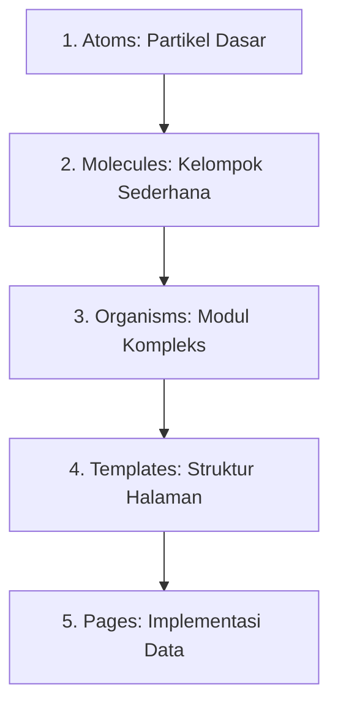
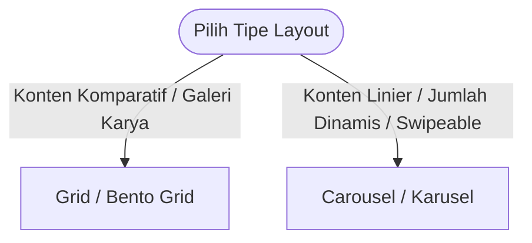

# Panduan Sistem Desain UI/UX & Spesifikasi Global

Dokumen ini merupakan panduan standar desain UI/UX global yang dapat digunakan kembali (*reusable*) di berbagai proyek web dan seluler. Panduan ini dirancang untuk menciptakan antarmuka yang estetis, terstruktur, berperforma tinggi, dan ramah aksesibilitas.

---

## 1. Sistem Tipografi (Typography & Fonts)

Gunakan kombinasi font terencana untuk memberikan hierarki informasi yang jelas. Kombinasi yang disarankan di bawah ini memadukan estetika teknikal geometris dengan editorial klasik:

*   **Font Judul (Headline Font - contoh: `Space Grotesk`)**: 
    *   *Karakter*: Geometris, bersih, dan modern.
    *   *Penerapan*: Digunakan untuk judul halaman, sub-judul bagian (H1, H2, H3), angka metrik utama, dan judul kartu.
*   **Font Narasi (Body Font - contoh: `Newsreader` atau Serif sejenis)**: 
    *   *Karakter*: Serif organik dengan tingkat keterbacaan tinggi untuk kalimat panjang.
    *   *Penerapan*: Paragraf panjang, biografi, penjelasan kasus, artikel, dan teks detail.
*   **Font Antarmuka (Label Font - contoh: `Manrope` atau Sans-Serif sejenis)**: 
    *   *Karakter*: Netral, modern, dan sangat terbaca pada ukuran mikro.
    *   *Penerapan*: Tombol, menu navigasi, placeholder input, teks petunjuk (*helper text*), dan metadata kecil.
*   **Font Telemetry/Kode (Monospace Font - contoh: `Geist Mono` atau sejenis)**:
    *   *Karakter*: Teknikal, seragam.
    *   *Penerapan*: Nilai angka, data teknis, blok kode, log sistem, dan teks telemetry HUD.

### Aturan Skala & Spasi Teks
*   **Ukuran Minimum Mobile**: Teks konten utama tidak boleh kurang dari `16px` (mencegah auto-zoom paksa oleh browser iOS).
*   **Tinggi Baris (Line-Height)**: Gunakan `1.5` hingga `1.75` untuk teks paragraf panjang agar tidak terasa sesak.
*   **Lebar Kontainer Teks**: Batasi lebar baris teks narasi sekitar **35–60 karakter** pada seluler dan **60–75 karakter** pada desktop agar mata tidak lelah bergeser.

---

## 2. Jarak, Margin, & Skala Spasi (Padding & Margin Scale)

Gunakan sistem spasi inkremental berbasis kelipatan **4dp / 8dp** untuk menjaga ritme visual yang konsisten di semua halaman:

| Token Spasi | Nilai Pixel | Contoh Penggunaan |
| :--- | :--- | :--- |
| **`space-1`** | `4px` | Margin internal mikro, jarak antara ikon dengan teks label. |
| **`space-2`** | `8px` | Gap antar tombol navigasi kecil, padding internal komponen kecil. |
| **`space-4`** | `16px` | Padding kartu (card), jarak antar elemen form input. |
| **`space-6`** | `24px` | Gutter sisi mobile, jarak antar baris konten sedang. |
| **`space-8`** | `32px` | Jarak antar komponen besar, padding vertikal section mobile. |
| **`space-12`**| `48px` | Margin antar section di desktop, padding vertikal banner. |
| **`space-16`**| `64px` | Jarak antar modul utama halaman desktop. |

### Margin Batas Layar (Screen Gutters)
*   **Mobile (< 640px)**: Gutter horizontal `16px` atau `24px` (`px-4` atau `px-6`).
*   **Tablet (640px - 1024px)**: Gutter horizontal `32px` (`px-8`).
*   **Desktop (> 1024px)**: Gutter horizontal `48px` hingga `80px` (`px-12` hingga `px-20`).

---

## 3. Metodologi Komponen: Atomic Design

Metodologi **Atomic Design** memecah komponen antarmuka menjadi 5 tingkatan hierarki untuk menciptakan pustaka komponen yang modular, mudah dipelihara, dan dapat digunakan kembali secara fleksibel:



### 1. Atoms (Atom)
*   **Definisi**: Blok pembangun dasar antarmuka yang tidak dapat dipecah lagi secara fungsional tanpa kehilangan kegunaannya.
*   **Karakteristik**: Bersifat *stateless* (tidak menyimpan state data API) dan hanya menerima visual props.
*   **Contoh**:
    *   `Button`: Tombol interaktif dengan varian primer/sekunder.
    *   `Input`: Bidang teks input kosong.
    *   `Icon`: Lambang SVG (misal: Lucide icons).
    *   `Badge/Tag`: Label teks dengan warna latar untuk status/kategori.

### 2. Molecules (Molekul)
*   **Definisi**: Kombinasi beberapa atom yang bersatu untuk menjalankan satu tanggung jawab fungsional sederhana.
*   **Karakteristik**: Mulai menangani interaksi pengguna tingkat dasar (misal: penanganan event focus, trigger onChange).
*   **Contoh**:
    *   `FormField`: Kombinasi dari atom `Label` + `Input` + pesan error `Label`.
    *   `SearchBox`: Gabungan atom `Input` pencarian + `Button` cari + `Icon` kaca pembesar.
    *   `TabButton`: Gabungan atom `Button` + `Icon` + status penanda aktif.

### 3. Organisms (Organisme)
*   **Definisi**: Modul antarmuka kompleks yang terdiri dari gabungan molekul dan/atau atom. Memiliki tanggung jawab operasional yang independen.
*   **Karakteristik**: Membentuk bagian antarmuka yang utuh dan dapat dipindahkan antar layout dengan mudah.
*   **Contoh**:
    *   `Topbar/Navbar`: Menggabungkan molekul menu navigasi, tombol toggle tema, dan logo.
    *   `CardItem`: Kartu data (misal: proyek/sertifikat) yang memuat molekul thumbnail gambar, deskripsi, dan tombol aksi detail.
    *   `LoginForm`: Formulir login utuh yang menggabungkan beberapa `FormField` molekul dan tombol submit atom.

### 4. Templates (Templat)
*   **Definisi**: Struktur tata letak tingkat halaman (*skeleton*) yang fokus pada distribusi letak komponen (Grid/Flex) tanpa memedulikan data asli.
*   **Karakteristik**: Menentukan bagaimana organisme berinteraksi dalam satu tata ruang layout. Menggunakan placeholder atau data mock.
*   **Contoh**:
    *   `DashboardLayout`: Template yang menentukan posisi `Sidebar` di kiri, `Topbar` di atas, dan area konten utama di kanan.
    *   `TwoColumnLayout`: Templat pembagi konten dengan rasio 70:30 untuk detail artikel/studi kasus.

### 5. Pages (Halaman)
*   **Definisi**: Instansiasi konkret dari templat antarmuka yang diisi dengan konten dinamis asli dari API, database, atau state global.
*   **Karakteristik**: Menangani pengambilan data (*data fetching*), penanganan error tingkat sistem, interaksi rute, dan state global (Redux/Context).
*   **Contoh**:
    *   `HomePage`: Halaman depan portofolio yang mengambil data profil aktif dan menyuapinya ke organisme karusel dan grid.
    *   `DashboardSettingsPage`: Halaman kelola pengaturan akun admin.

---

## 4. Sistem Tata Letak (Layout & Responsiveness)

Menerapkan pendekatan desain **Mobile-First** secara ketat untuk menjamin fungsionalitas di layar terkecil sebelum menskalakannya ke layar besar:

*   **Pencegahan Scroll Horizontal**: Seluruh layout kontainer harus menggunakan unit lebar relatif (`w-full`, `max-w-x`) dan properti `box-sizing: border-box`. Kontainer dilarang keras menggunakan lebar statis (`px`) yang melebihi lebar layar mobile minimum (320px).
*   **Batas Lebar Kontainer (Desktop Max-Width)**: Batasi kontainer utama halaman pada rentang `max-w-6xl` (1152px) hingga `max-w-7xl` (1280px) agar tata letak tetap proporsional pada monitor layar lebar.
*   **Safe-Area Compliance**: Selalu berikan inset padding tambahan pada bagian bawah halaman seluler untuk mencegah elemen interaktif/tombol melayang tertutup oleh *home indicator bar* bawaan OS (misalnya iOS gesture bar).

---

## 5. Perbandingan Layout: Grid vs Karusel (Carousel)

Pemilihan tipe layout harus disesuaikan dengan jenis konten dan pola interaksi pengguna:



### A. Grid & Bento Grid (Kapan Harus Digunakan?)
*   **Karakteristik**: Tata letak dua dimensi yang menyeimbangkan konten secara struktural.
*   **Kapan Cocok**:
    *   Galeri proyek, portofolio karya, dasbor analitik.
    *   Bento Grid sangat cocok jika ingin menonjolkan bobot visual asimetris (misalnya: Proyek unggulan berukuran besar, proyek biasa berukuran lebih kecil).
*   **Penerapan Terbaik**:
    *   Gunakan grid 12-kolom yang dinamis dengan properti `col-span` bervariasi berdasarkan breakpoints (contoh: `col-span-12` di mobile, `md:col-span-6` di tablet, `lg:col-span-8` untuk featured card di desktop).

### B. Karusel / Carousel (Kapan Harus Digunakan?)
*   **Karakteristik**: Tata letak satu dimensi horizontal yang menghemat ruang vertikal.
*   **Kapan Cocok**:
    *   Kumpulan sertifikat, logo mitra, testimoni klien, galeri gambar sub-kasus.
    *   Data dinamis yang jumlahnya tidak terduga dan tidak harus langsung dilihat sekaligus.
*   **Penerapan Terbaik**:
    *   Aktifkan *momentum scrolling* horizontal (`overflow-x-auto snap-x snap-mandatory`) yang bersahabat dengan sentuhan jari.
    *   Sediakan dot indikator di bagian bawah yang diperbarui secara dinamis berdasarkan posisi gulir (`scrollLeft`), serta tombol panah navigasi kiri/kanan sebagai cadangan aksesibilitas.

---

## 6. Input & Form (Interaksi, Validasi, & File Upload)

Komponen formulir harus memandu pengguna dengan memberikan umpan balik visual instan.

### A. Status UI Input (Input UI States)

```
[ Default State ] ── Hover/Focus ── Valid/Error ── Disabled/Read-Only
```

1.  **Default**: Border tipis netral dengan kontras rendah terhadap warna permukaan kartu.
2.  **Hover**: Border sedikit lebih tebal/gelap dan perubahan ikon kursor menjadi pointer.
3.  **Focus**: Border berubah warna menjadi aksen utama (misal: warna primer neon), disertai dengan bayangan halus (*glow*) tanpa menggeser posisi elemen.
4.  **Disabled**: Opacity dikurangi (`38% - 50%`), kursor berubah menjadi `not-allowed`, dan form dikunci dari masukan data.
5.  **Read-Only**: Tampilan bersih tanpa bayangan focus, namun teks tetap dapat disalin (berbeda secara visual dengan disabled).

### B. Validasi & Penanganan Error Form (Error Handling)
*   **Lokasi Pesan Error**: Tulis pesan error yang jelas dan spesifik tepat di bawah kolom input yang bermasalah. Hindari menumpuk semua pesan error hanya di bagian atas form.
*   **Indikasi Warna & Ikon**: Kolom yang bermasalah harus berubah warna menjadi merah semantik (warna error) pada border dan teks pesan errornya, disertai ikon peringatan (tidak boleh mengandalkan warna merah saja demi pengguna buta warna).
*   **Manajemen Fokus**: Setelah pengguna mengirimkan form dan terjadi error, pindahkan fokus kursor secara otomatis ke kolom pertama yang tidak valid.

### C. Drag & Drop & Cropping Image (File Upload)
*   **Drop Zone State**: Saat berkas ditarik di atas area upload, ubah gaya border area menjadi garis putus-putus (*dashed border*) yang menyala/aktif, serta tampilkan overlay teks penjelas (misalnya: "Lepaskan berkas di sini").
*   **Cropping Interface**:
    *   Tampilkan modal overlay yang membatasi gerakan foto di dalam rasio aspek (*aspect ratio*) yang ditargetkan (misalnya persegi `1:1` untuk avatar).
    *   Sediakan slider zoom interaktif di bawah area potong dengan tap target yang cukup besar untuk memudahkan pengguna mobile.

---

## 7. Sistem Tombol & Loading State (Button & Loading States)

Tombol adalah elemen interaktif utama untuk mengirimkan data atau memicu alur kerja antarmuka.

### A. Varian Tombol (Button Variants)
1.  **Primary Button (Tombol Utama)**: Menggunakan warna latar belakang primer (`--color-primary`) dengan teks kontras tinggi (`--color-on-primary`). Digunakan hanya untuk tindakan konfirmasi final utama (Simpan, Kirim, Tambah Baru).
2.  **Secondary Button (Tombol Sekunder)**: Menggunakan batas border tipis (`border border-outline/20`) dengan background transparan. Digunakan untuk tindakan sekunder (Batal, Kembali, Edit).
3.  **Ghost Button**: Tanpa batas border dan tanpa warna latar belakang bawaan (hanya muncul warna permukaan tipis saat di-hover). Digunakan untuk aksi yang minim prioritas (Tutup, Bersihkan filter).
4.  **Destructive Button**: Menggunakan warna merah semantik (`--color-error`). Digunakan khusus untuk konfirmasi penghapusan permanen.

### B. Status Loading & Pencegahan Double-Submit
*   **Double-Submit Prevention**: Saat proses pengiriman data API asinkron sedang berlangsung, tombol pengirim wajib dinonaktifkan secara programatik (`disabled = true`) untuk mencegah pengiriman data ganda akibat pengguna mengeklik berulang kali secara tidak sengaja.
*   **Loading Indicator**: Ganti teks tombol secara dinamis dengan ikon spinner berputar atau teks seperti *"Memproses..."*. Ukuran (lebar dan tinggi) tombol wajib dipertahankan tetap sama agar tidak menyebabkan pergeseran tata letak antarmuka di sekitarnya.

---

## 8. Sistem Notifikasi & Toast (Notification & Toast System)

Sistem notifikasi toast digunakan untuk memberikan umpan balik asinkron di luar validasi formulir langsung, terutama untuk kegagalan operasi sistem, jaringan, atau status global.

### A. Klasifikasi Tipe & Gaya Visual Toast
Desain toast harus memiliki warna latar belakang kontras tinggi dengan aksen warna semantik di sisi tepi atau ikon:

| Tipe Toast | Warna Aksen | Gaya Ikon | Kegunaan Utama |
| :--- | :--- | :--- | :--- |
| **`Success`** | Hijau Semantik | Check Circle | Operasi berhasil (misal: "Profil berhasil disimpan", "Urutan proyek disimpan"). |
| **`Error`** | Merah Semantik | Alert Circle | Kegagalan kritis sistem atau jaringan. |
| **`Warning`** | Kuning/Jingga | Alert Triangle | Peringatan tindakan (misal: "Koneksi lambat", "File terlalu besar"). |
| **`Info`** | Biru Semantik | Info | Informasi kontekstual non-kritis (misal: "Sesi Anda akan berakhir"). |

### B. Penanganan Error di Luar Formulir (Non-Form Error Handling)
Formulir menangani error input lokal, sedangkan Toast digunakan untuk menangani skenario global berikut:
1.  **Kegagalan Koneksi/API (500 atau Network Error)**:
    *   *Skenario*: Server mati, basis data Supabase tidak merespon, atau koneksi internet pengguna terputus saat fetch data.
    *   *Feedback*: Tampilkan toast merah dengan pesan bersahabat (misal: *"Koneksi terganggu. Silakan coba beberapa saat lagi."*) disertai tombol **"Retry" (Coba Lagi)** langsung di dalam toast.
2.  **Sesi Kedaluwarsa (Session Timeout)**:
    *   *Skenario*: Token JWT di cookie kedaluwarsa atau dihapus di middleware saat pengguna melakukan aksi di dashboard.
    *   *Feedback*: Tampilkan toast kuning berisi pesan *"Sesi Anda telah berakhir. Anda akan diarahkan ke halaman login."*, pertahankan selama 4 detik sebelum mengarahkan rute secara otomatis.
3.  **Kegagalan Upload File Besar/Tidak Valid**:
    *   *Skenario*: Pengguna mencoba mengunggah CV PDF atau gambar melebihi batas (misal: > 5MB) atau format tidak diizinkan.
    *   *Feedback*: Tampilkan toast error dengan alasan spesifik (misal: *"Gagal mengunggah berkas. Ukuran maksimum adalah 5MB."*).
4.  **Kegagalan Operasi Destruktif / Bulk Delete**:
    *   *Skenario*: Gagal menghapus item karena foreign key constraint di database.
    *   *Feedback*: Tampilkan toast error yang menjelaskan item tidak dapat dihapus karena masih digunakan. Jika berhasil, berikan opsi tombol **"Undo" (Batalkan)** pada toast sukses.

### C. Aturan Perilaku (Toast Behavior) & Aksesibilitas
*   **Auto-Dismiss**: Toast tipe `Success` dan `Info` wajib ditutup otomatis dalam waktu **3 sampai 5 detik** agar tidak menumpuk di layar.
*   **Persistence**: Toast tipe `Error` atau `Warning` kritis **dilarang ditutup otomatis**. Toast harus tetap berada di layar sampai pengguna menekan tombol tutup `[X]` secara manual untuk memastikan pesan terbaca.
*   **Batas Antrian (Stacking Limit)**: Batasi maksimal **3 toast** bertumpuk di layar secara bersamaan (biasanya di kanan atas atau bawah tengah). Toast lama akan tergeser keluar (slide-out) secara otomatis jika ada toast baru.
*   **Aksesibilitas Pembaca Layar (A11y)**:
    *   Toast biasa menggunakan atribut `aria-live="polite"` agar tidak memotong pembacaan layar yang sedang aktif.
    *   Toast `Error` kritis wajib menggunakan `role="alert"` atau `aria-live="assertive"` agar langsung diumumkan seketika oleh *screen reader*.

---

## 9. Sistem Modal & Dialog Konfirmasi (Modal & Confirmation Dialogs)

Dialog modal memotong fokus pengguna untuk meminta konfirmasi atau memproses informasi tambahan tanpa berpindah halaman.

### A. Backdrop (Scrim) & Visual Styling
*   **Scrim Overlay**: Gunakan overlay hitam dengan tingkat transparansi `40%` sampai `60%` dan efek kabur (`backdrop-blur-md` atau kustom `backdrop-filter: blur(4px)`) untuk mengisolasi konten latar belakang dan memusatkan pandangan pengguna pada modal.
*   **Responsive Sizing**: 
    *   Mobile: Modal melebar memenuhi layar (`w-full` dengan sedikit margin horizontal, `mx-4`) atau bergeser dari bawah ke atas (*bottom sheet* style).
    *   Desktop: Ukuran lebar dibatasi pada rentang `max-w-md` (448px) hingga `max-w-lg` (512px).

### B. Interaksi & Konfirmasi Aksi Destruktif
*   **Metode Penutupan Modal (Non-Destruktif)**: Pengguna dapat menutup modal dengan menekan tombol tutup `[X]`, menekan tombol `Batal` (Cancel), atau mengeklik area backdrop gelap.
*   **Modal Destruktif (Double Confirmation)**:
    *   Untuk tindakan berisiko tinggi (misalnya menghapus profil, menghapus data proyek permanen), tombol konfirmasi aksi wajib menggunakan warna merah semantik (warna error).
    *   Modal destruktif **tidak boleh ditutup** hanya dengan mengeklik area backdrop luar guna mencegah penutupan yang tidak disengaja. Pengguna harus memilih `Batal` atau `Konfirmasi` secara sadar.

### C. Aksesibilitas Keyboard (Keyboard Navigation & Focus Trap)
*   **Focus Trap**: Begitu modal terbuka, fokus keyboard (tekanan tombol `Tab`) harus dikunci hanya pada elemen interaktif di dalam modal tersebut. Fokus dilarang lolos ke elemen latar belakang.
*   **Tombol `Esc`**: Menekan tombol `Escape` pada keyboard harus memicu penutupan modal instan (kecuali untuk modal destruktif terkunci).

---

## 10. Desain Keadaan Kosong (Empty States)

Tampilan kosong (*empty state*) tidak boleh berupa halaman putih kosong, melainkan area terencana yang informatif untuk memandu tindakan pengguna selanjutnya.

### A. Elemen Visual Penyusun Empty State
Sebuah area kosong yang baik wajib memuat struktur berikut:
1.  **Ikon/Ilustrasi Redup**: Gunakan ikon deskriptif berukuran besar (misal: `48px` - `64px`) dengan opacity rendah (`opacity-30` atau `opacity-40`) untuk memberikan isyarat visual tanpa mendominasi antarmuka.
2.  **Judul Ringkas**: Kalimat singkat menjelaskan apa yang kosong (misal: *"Belum Ada Proyek Ditambahkan"*).
3.  **Deskripsi Pendukung**: Kalimat penjelasan pendek untuk memicu aksi pengguna (misal: *"Silakan unggah proyek terbaik Anda untuk ditampilkan pada portofolio publik."*).
4.  **Tombol CTA Utama**: Menyediakan tombol aksi utama di bawah deskripsi untuk langsung mengisi kekosongan tersebut (misal: *"Tambah Proyek Baru"*).

### B. Penempatan & Dimensi
*   Empty state harus diposisikan di tengah-tengah kontainer utama halaman, baik secara vertikal maupun horizontal (`flex flex-col items-center justify-center text-center`).
*   Lebar blok teks dibatasi maksimal `400px` untuk menjaga keterbacaan layout.

---

## 11. Sistem Navigasi & Breadcrumbs (Navigation & Breadcrumbs)

Navigasi memberikan orientasi lokasi dan jalan kembali bagi pengguna saat berada di dashboard maupun halaman studi kasus.

### A. Header Navigasi Lengket (Sticky Header)
*   **Dimensi**: Ketinggian header navigasi dibatasi pada rentang `64px` (16unit) hingga `80px` (20unit).
*   **Visual**: Terapkan efek glassmorphism (`backdrop-blur-md` dengan background transparan beropasitas `70% - 80%`) untuk memberikan estetika modern, disertai garis pembatas bawah tipis (`1px`) yang samar (`border-outline/10`).
*   **Mobile Hamburgers**: Tombol menu hamburger di seluler wajib memiliki ukuran area sentuh minimal `44x44px`.

### B. Breadcrumbs (Jejak Tautan)
*   **Struktur Hirarki**: Gunakan notasi horizontal berurutan (misal: `Dashboard > Proyek > Edit Proyek`).
*   **Status Tautan**:
    *   Halaman saat ini (posisi terakhir) ditulis tebal (*bold*), menggunakan warna foreground utama, dan **tidak dapat diklik**.
    *   Halaman induk (parent pages) ditulis dengan warna kontras sedang dan wajib berupa tautan yang dapat diklik untuk memudahkan navigasi mundur cepat.
*   **Pemisah (Separator)**: Gunakan simbol visual sederhana seperti garis miring `/` atau kurung siku `>` dengan warna pudar agar tidak mengalihkan perhatian dari nama halaman.

---

## 12. Papan Informasi: Segmented Control, Tabs, & Tooltips

Mengatur tampilan konten tersegmentasi dan memberikan bantuan informasi mikro di antarmuka.

### A. Sistem Tab & Segmented Control
*   **Tujuan**: Mengurangi penumpukan informasi vertikal dengan membagi menu ke dalam sub-kategori sejajar.
*   **Penanda Aktif (Active Indicator)**:
    *   Gunakan garis bawah (*bottom line border*) setebal `2px` berwarna primer neon, atau terapkan latar belakang kontainer dengan bayangan tipis yang bergeser halus (`duration-200`) menggunakan CSS transition saat berpindah tab.
    *   Teks tab aktif wajib menggunakan bobot font lebih tebal (`font-bold` atau `font-semibold`) untuk membedakannya dengan opsi yang tidak terpilih.

### B. Sistem Tooltip & Popover
*   **Tooltip**: Penjelasan teks mini (maksimal 2 baris) yang muncul ketika kursor mengambang di atas ikon pemicu (contoh: ikon bantuan `?` di samping label form).
*   **Popover**: Kontainer informasi lebih dinamis (dapat memuat link, teks berformat, atau tombol aksi kecil) yang muncul ketika elemen pemicu diklik.
*   **Aturan Trigger Delay**:
    *   Kemunculan Tooltip wajib diberi penundaan waktu (*trigger delay*) sekitar **200ms - 300ms** setelah hover. Ini penting untuk mencegah ketidaknyamanan visual (tooltip berkedip-kedip) ketika pengguna hanya menggeser kursor melintasi layar secara cepat.
    *   **Auto-Positioning**: Tooltip/Popover wajib menyesuaikan lokasinya secara otomatis (ke atas, kanan, bawah, kiri) agar tidak terpotong di sudut layar browser.

---

## 13. Pengurutan Item (Sortable Items)

Saat mengimplementasikan fitur Drag & Drop sorting (misalnya menggunakan `@dnd-kit`), visualisasikan proses pergeseran agar pengguna merasa memiliki kendali penuh:

*   **Elevasi & Shadow**: Item yang sedang ditarik (*active item*) harus tampak terangkat dengan menambahkan efek bayangan dalam (`box-shadow`), opasitas sedikit dikurangi (`opacity-80`), dan ditingkatkan ke tingkat layer teratas (`z-index-50`).
*   **Kursor Feedback**: Ubah ikon kursor mouse menjadi `grab` saat diarahkan ke pegangan seret (*drag handle*), dan menjadi `grabbing` saat proses penyeretan berlangsung.
*   **Placeholder Gap**: Sediakan area kosong transparan (*placeholder outline*) di lokasi penempatan baru agar pengguna dapat melihat ke mana item tersebut akan jatuh jika dilepaskan.

---

## 14. Sistem Skeleton UI (Skeleton UI Loading States)

Skeleton UI digunakan untuk menggantikan spinner pemuatan tradisional. Ini memberikan persepsi performa halaman yang lebih cepat dengan menampilkan tata letak sementara yang menyerupai bentuk konten asli sebelum data dari API berhasil dimuat.

```
[ Data Sedang Dimuat ] ──> Tampilkan Skeleton UI (Pulsing/Shimmer) ──> Swap dengan Elemen Asli (Fade-in)
```

### A. Gaya Visual & Efek Animasi
*   **Warna Dasar Kontainer**: Gunakan abu-abu netral dengan tingkat saturasi rendah untuk menyesuaikan skema warna latar belakang.
    *   *Light Mode*: Tailwind `bg-neutral-200` atau `#e5e5e5`.
    *   *Dark Mode*: Tailwind `bg-neutral-800` atau `#262626`.
*   **Efek Shimmer (Sapuan Cahaya)**: Skeleton wajib memiliki animasi sapuan cahaya dari kiri ke kanan yang berputar secara mulus menggunakan gradien linier transparan, atau menggunakan animasi denyut bawaan CSS (`animate-pulse`) dengan transisi opasitas dari `0.5` ke `1` secara berkala.

### B. Kemiripan Bentuk & Geometri (Shape Mimicry)
Setiap elemen visual asli wajib memiliki padanan bentuk skeleton yang serupa untuk menghindari kejutan tata letak:
1.  **Avatar / Foto Profil**: Gunakan lingkaran penuh (`rounded-full`) dengan ukuran lebar dan tinggi yang sama persis dengan avatar asli (misal: `w-12 h-12`).
2.  **Gambar / Thumbnail**: Gunakan persegi panjang bersudut tumpul (`rounded-lg` atau `rounded-xl`) dengan mengunci rasio aspek gambar asli (contoh: `aspect-video` atau `aspect-[16/10]`).
3.  **Teks & Paragraf**:
    *   Dirender sebagai garis horizontal dengan ujung tumpul (`rounded-md` atau `rounded-full`).
    *   Tinggi skeleton teks judul rata-rata `18px` - `24px`, sedangkan teks paragraf `12px` - `14px`.
    *   *Penting*: Jika memuat paragraf multi-baris, baris terakhir wajib dibuat lebih pendek (misalnya selebar `w-3/4` atau `w-1/2`) untuk meniru pemutusan kalimat alami.

### C. Pencegahan CLS (Cumulative Layout Shift) & Transisi Mulus
*   **Konsistensi Dimensi**: Setiap kerangka skeleton wajib membungkus area dengan tinggi (`height`) dan spasi margin/padding yang identik dengan kartu konten asli agar layout tidak melompat ketika data terisi.
*   **Efek Perpindahan Mulus (Conditional Swap)**: Saat status loading selesai (`isLoading === false`), jangan langsung mengganti komponen secara kasar. Terapkan efek transisi memudar lembut (*fade-in* dengan opasitas `0` ke `1` selama `300ms`) pada elemen data asli untuk menyembunyikan pergantian aset.

---

## 15. Optimasi Kinerja UI (Performance & UX)

Aplikasi dengan visual premium harus tetap ringan dan responsif dengan meminimalkan pergeseran tata letak dan beban pemrosesan:

### A. Pencegahan Layout Shift (CLS - Cumulative Layout Shift)
*   **Eksplisitkan Dimensi Media**: Selalu tentukan rasio aspek (`aspect-ratio`) atau tinggi dan lebar piksel pada tag gambar dan video sebelum aset dimuat.
*   **Skeleton Integration**: Terapkan komponen Skeleton UI (seperti yang didefinisikan pada bagian 14) secara default pada setiap modul pemuatan data asinkron.

### B. Pembatasan Transisi & GPU Acceleration
*   **Animasi Efisien**: Gunakan properti CSS `transform` (skala, rotasi, translasi) dan `opacity` untuk animasi interaktif. Hindari menganimasikan properti layout seperti `width`, `height`, `top`, dan `left` karena akan memaksa browser melakukan kalkulasi ulang tata letak (*reflow*) yang memicu lag pada perangkat dengan spesifikasi rendah.
*   **Damping Physics**: Jika menggunakan animasi pegas (*spring physics*), terapkan batas nilai toleransi agar pergerakan tidak memantul tanpa henti (*jittering*).
*   **Debounce & Throttle**: Terapkan metode pembatasan frekuensi pada fungsi yang mendengarkan aktivitas browser berulang (seperti `window.onscroll` atau `window.onresize`) agar tidak membebani pemrosesan utama (*main thread*).

---

## 16. Lembar Evaluasi Kualitas UI/UX (Global QC Checklist)

Gunakan checklist ini sebagai validasi sebelum meluncurkan fitur atau aplikasi ke tahap produksi:

### Visual & Kontras
- [ ] Rasio kontras teks utama minimal `4.5:1` di kedua tema (terang & gelap).
- [ ] Ikon yang digunakan konsisten dalam satu rumpun keluarga desain (ketebalan stroke setara).
- [ ] Tidak ada emoji yang digunakan sebagai ikon antarmuka fungsional (gunakan SVG).
- [ ] Warna border separator terlihat kontras pada mode gelap dan tidak terlalu tajam di mode terang.

### Sentuhan & Interaksi
- [ ] Ukuran tap area tombol interaktif minimal `44x44px` di mobile.
- [ ] Jarak horizontal/vertikal antar target sentuh minimal `8px`.
- [ ] Feedback visual hover dan pressed terimplementasi dengan baik di semua tombol.
- [ ] Drag & Drop item menunjukkan indikator bayangan elevasi saat aktif digeser.
- [ ] Tombol pengirim formulir dinonaktifkan (`disabled`) secara otomatis saat status loading aktif.

### Kinerja & Aksesibilitas
- [ ] CLS bernilai di bawah `0.1` saat pemuatan halaman pertama kali.
- [ ] Skeleton loading ditampilkan dengan bentuk geometri yang presisi meniru elemen visual asli (avatar bulat, teks multi-baris pendek di akhir).
- [ ] Mendukung adaptasi sistem aksesibilitas `prefers-reduced-motion` untuk menghentikan animasi berat.
- [ ] Formulir error mengaktifkan fokus kursor otomatis ke kolom bermasalah pertama.
- [ ] Area upload berkas menunjukkan indikator drop zone aktif saat file didekatkan.
- [ ] Toast pemberitahuan menggunakan atribut `aria-live` yang tepat (`polite` atau `assertive`/`role="alert"`).
- [ ] Modal dialog mengaktifkan *focus trap* dan dapat ditutup menggunakan tombol `Esc`.
- [ ] Halaman tanpa data menyajikan tampilan *empty state* informatif lengkap dengan tombol aksi (CTA).
- [ ] Tooltip navigasi memiliki delay minimal `200ms` sebelum muncul di layar.
